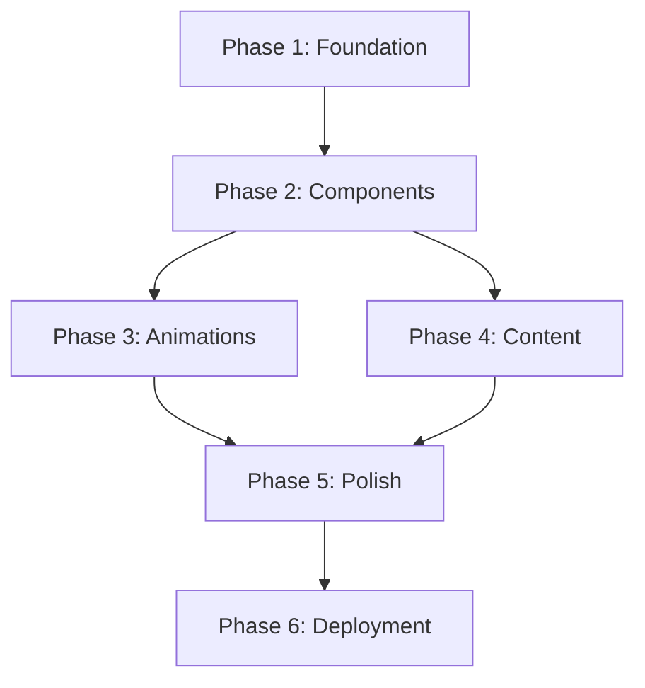

# Formix-Inspired Landing Page Redesign - Strategic Plan

**Project Code:** FORMIX-REDESIGN-2025
**Created:** 2025-11-28
**Last Updated:** 2025-11-28
**Status:** Planning
**Priority:** High
**Estimated Duration:** 12-16 hours

---

## Executive Summary

Create a pixel-perfect copy of the Formix landing page design (https://formix.framer.website) as a separate experimental version of adminai.tech. The new design will be developed in `public/landing-formix/` to preserve the existing production site while allowing safe experimentation with modern design patterns, animations, and user experience improvements.

**Key Objectives:**
- Replicate Formix's visual design system (colors, typography, spacing)
- Implement smooth scroll-based animations and transitions
- Create responsive layout with mobile-first approach
- Maintain separation from production landing page
- Establish foundation for future A/B testing

**Success Criteria:**
- Visual parity with Formix reference design (95%+ match)
- Performance: Lighthouse score 90+ (Performance, Accessibility, Best Practices)
- All animations smooth at 60fps on desktop, 30fps on mobile
- Full responsive support (320px - 2560px viewports)
- Zero impact on existing production site

---

## Current State Analysis

### Existing Landing Page (`public/landing/index.html`)
**Strengths:**
- Working production site with established content
- Dark/light theme toggle functionality
- FAQ accordion with smooth animations
- Mobile-responsive navigation
- Glass morphism effects (glass-surface.css)

**Technical Stack:**
- Vanilla HTML/CSS/JavaScript
- Google Fonts: Exo 2 (400, 700, 900)
- Custom glass morphism styling
- Grid/Flexbox layouts
- Dark theme (#0a0a0a background) with pink accents (#EC4899)

**Design Patterns:**
- Glass cards with hover effects
- Fixed navigation with blur backdrop
- Gradient backgrounds
- Modal system for forms
- Demo chat interface

### Gap Analysis
**What Formix Has That We Don't:**
1. **Typography:** Geist + Inter fonts with tighter letter-spacing
2. **Color Scheme:** Light neutral backgrounds with vibrant orange accent (#ff3700)
3. **Animations:** Sophisticated scroll-triggered animations, custom cursor, blend modes
4. **Layout:** Max-width container system (1270px), fixed header with transform offsets
5. **Performance:** Optimized with will-change, aspect-ratio, CSS custom properties
6. **Components:** Icon masking system, mobile toggle animations, hover transformations

---

## Proposed Future State

### Design System

#### Color Palette
```css
/* Primary Colors */
--bg-primary: #f0f0f0;        /* Light neutral background */
--bg-secondary: #ebeced;      /* Subtle variation */
--text-primary: #151619;      /* Dark charcoal */
--text-secondary: #4f4f4f;    /* Medium gray */
--text-muted: #707070;        /* Light gray */
--accent-primary: #ff3700;    /* Vibrant orange */
--border-color: #e5e5e5;      /* Light borders */

/* Overlays & Effects */
--overlay-light: rgba(255, 255, 255, 0.08);
--overlay-dark: rgba(0, 0, 0, 0.26);
```

#### Typography System
```css
/* Font Families */
--font-heading: 'Geist', -apple-system, BlinkMacSystemFont, sans-serif;
--font-body: 'Inter', -apple-system, BlinkMacSystemFont, sans-serif;

/* Font Weights */
--weight-normal: 400;
--weight-medium: 500;
--weight-semibold: 600;
--weight-bold: 700;
--weight-extrabold: 800;
--weight-black: 900;

/* Font Sizes (Desktop) */
--text-xs: 0.75rem;    /* 12px */
--text-sm: 0.875rem;   /* 14px */
--text-base: 1rem;     /* 16px */
--text-lg: 1.125rem;   /* 18px */
--text-xl: 1.25rem;    /* 20px */
--text-2xl: 1.5rem;    /* 24px */
--text-3xl: 1.875rem;  /* 30px */
--text-4xl: 2.25rem;   /* 36px */
--text-5xl: 3rem;      /* 48px */

/* Line Heights */
--leading-tight: 1.2;
--leading-normal: 1.3;
--leading-relaxed: 1.5;

/* Letter Spacing */
--tracking-tight: -0.05em;
--tracking-normal: -0.035em;
--tracking-wide: 0;
```

#### Spacing Scale
```css
--space-xs: 10px;
--space-sm: 20px;
--space-md: 35px;
--space-lg: 50px;
--space-xl: 80px;

/* Component-Specific */
--header-padding-v: 20px;
--header-padding-h-mobile: 35px;
--header-padding-h-desktop: 80px;
--section-gap: 35px;
--component-gap: 10px;
```

#### Breakpoints
```css
--breakpoint-mobile: 810px;
--breakpoint-desktop: 1200px;
--container-max-width: 1270px;
```

### Architecture

#### Directory Structure
```
public/landing-formix/
├── index.html                 # Main landing page
├── css/
│   ├── reset.css             # CSS normalization
│   ├── variables.css         # Design tokens
│   ├── base.css              # Base styles
│   ├── layout.css            # Grid/flex layouts
│   ├── components/
│   │   ├── navigation.css    # Header & nav
│   │   ├── hero.css          # Hero section
│   │   ├── buttons.css       # Button components
│   │   ├── cards.css         # Card components
│   │   └── forms.css         # Form elements
│   ├── animations.css        # Keyframes & transitions
│   └── utilities.css         # Helper classes
├── js/
│   ├── main.js               # Entry point
│   ├── animations.js         # Scroll animations
│   ├── cursor.js             # Custom cursor
│   └── navigation.js         # Mobile menu
├── fonts/
│   ├── geist/                # Geist font files
│   └── inter/                # Inter font files
└── assets/
    └── icons/                # SVG icons
```

#### Component Hierarchy
```
Page
├── Header (Fixed)
│   ├── Logo
│   ├── Navigation
│   │   ├── Nav Links
│   │   └── CTA Buttons
│   └── Mobile Toggle
├── Hero Section
│   ├── Heading
│   ├── Subheading
│   └── CTA Group
├── Features Section
│   └── Feature Cards (Grid)
├── Demo Section
│   └── Interactive Demo
├── Pricing Section
│   └── Pricing Cards
├── FAQ Section
│   └── Accordion Items
└── Footer
    ├── Links
    ├── Social Icons
    └── Legal Info
```

---

## Implementation Phases

### Phase 1: Foundation & Setup (2-3 hours)
**Goal:** Establish project structure and design system foundation

#### 1.1 Project Initialization
- [ ] Create `public/landing-formix/` directory structure
- [ ] Set up Git branch: `feature/formix-redesign`
- [ ] Initialize base HTML template with meta tags
- [ ] Configure viewport and responsive settings
- [ ] Add favicon and social meta tags

**Acceptance Criteria:**
- Clean directory structure created
- Base HTML validates with W3C validator
- Mobile viewport configured correctly
- All meta tags present

**Effort:** S (30 min)
**Dependencies:** None

#### 1.2 Font Integration
- [ ] Download Geist font (weights: 600, 700, 900)
- [ ] Download Inter font (weights: 400, 500, 600, 700, 800, 900)
- [ ] Create `@font-face` declarations with proper fallbacks
- [ ] Add preload hints for critical fonts
- [ ] Test font loading on slow connections

**Acceptance Criteria:**
- Fonts load without FOUT (Flash of Unstyled Text)
- Fallback fonts match x-height
- Font files optimized (<50KB per weight)
- Fonts display correctly in all browsers

**Effort:** M (1 hour)
**Dependencies:** 1.1
**Resources:** https://fonts.google.com/specimen/Inter, Geist from Vercel

#### 1.3 CSS Architecture
- [ ] Create `css/reset.css` (normalize styles)
- [ ] Build `css/variables.css` with design tokens
- [ ] Set up `css/base.css` (html, body, typography)
- [ ] Create modular CSS structure
- [ ] Implement CSS custom properties for theming

**Acceptance Criteria:**
- Zero browser default styles
- All design tokens defined
- Base styles apply globally
- CSS validates without errors

**Effort:** M (1 hour)
**Dependencies:** 1.2

#### 1.4 Layout System
- [ ] Create container system (max-width 1270px)
- [ ] Build responsive grid utilities
- [ ] Implement flexbox utilities
- [ ] Add spacing scale utilities
- [ ] Create visibility classes for breakpoints

**Acceptance Criteria:**
- Container centers correctly on all screens
- Grid system responsive
- Spacing consistent with design tokens
- Hidden/visible classes work at breakpoints

**Effort:** M (1 hour)
**Dependencies:** 1.3

---

### Phase 2: Core Components (3-4 hours)
**Goal:** Build reusable UI components matching Formix design

#### 2.1 Navigation Header
- [ ] Create fixed header with backdrop blur
- [ ] Build logo component
- [ ] Implement horizontal navigation menu
- [ ] Add hover states with transitions
- [ ] Create `.isCurrent` active state styling
- [ ] Build mobile hamburger toggle
- [ ] Implement mobile menu dropdown
- [ ] Add scroll-based header shadow

**Acceptance Criteria:**
- Header stays fixed on scroll
- Navigation items highlight on hover
- Active page marked with `.isCurrent`
- Mobile menu toggles smoothly
- Z-index layering correct (z-index: 10)

**Effort:** L (2 hours)
**Dependencies:** 1.4
**Files:** `css/components/navigation.css`, `js/navigation.js`

#### 2.2 Button System
- [ ] Create primary button style
- [ ] Create secondary button style
- [ ] Add icon button variants
- [ ] Implement hover/active states
- [ ] Add loading state (spinner)
- [ ] Build CTA button group
- [ ] Test accessibility (focus states, ARIA)

**Acceptance Criteria:**
- Buttons match Formix exactly (7px padding)
- Hover transforms smooth
- Icons align correctly (21-24px)
- Keyboard navigation works
- Screen reader friendly

**Effort:** M (1.5 hours)
**Dependencies:** 1.4
**Files:** `css/components/buttons.css`

#### 2.3 Card Components
- [ ] Create base card component
- [ ] Add aspect-ratio utilities
- [ ] Implement hover effects
- [ ] Build icon masking system
- [ ] Add shadow/border treatments
- [ ] Create card grid layout
- [ ] Test overflow clipping

**Acceptance Criteria:**
- Cards maintain aspect ratio
- Icons use webkit-mask
- Hover effects perform well (60fps)
- Grid responsive on all breakpoints

**Effort:** M (1.5 hours)
**Dependencies:** 1.4
**Files:** `css/components/cards.css`

---

### Phase 3: Animations & Interactions (3-4 hours)
**Goal:** Implement sophisticated animations matching Formix

#### 3.1 Scroll Animations
- [ ] Set up Intersection Observer API
- [ ] Create fade-in animation on scroll
- [ ] Build slide-up animation
- [ ] Implement staggered animations for lists
- [ ] Add `will-change` optimization
- [ ] Create animation timeline utility
- [ ] Test performance on low-end devices

**Acceptance Criteria:**
- Animations trigger at viewport intersection
- Smooth 60fps on desktop
- Animations disabled on reduced-motion preference
- No layout thrashing

**Effort:** L (2 hours)
**Dependencies:** Phase 2 complete
**Files:** `js/animations.js`, `css/animations.css`

**Technical Approach:**
```javascript
// Intersection Observer with threshold
const observer = new IntersectionObserver((entries) => {
  entries.forEach(entry => {
    if (entry.isIntersecting) {
      entry.target.classList.add('animate-in');
    }
  });
}, { threshold: 0.2 });

// Observe all animated elements
document.querySelectorAll('[data-animate]').forEach(el => {
  observer.observe(el);
});
```

#### 3.2 Custom Cursor
- [ ] Create custom cursor element
- [ ] Track mouse position with requestAnimationFrame
- [ ] Implement cursor variants (pointer, grab, grabbing)
- [ ] Add cursor blend modes
- [ ] Create hover interactions
- [ ] Disable on touch devices
- [ ] Test performance impact

**Acceptance Criteria:**
- Cursor follows mouse smoothly
- Variants change based on hover targets
- No jank on rapid movement
- Disabled on mobile/tablet

**Effort:** M (1.5 hours)
**Dependencies:** None
**Files:** `js/cursor.js`, `css/components/cursor.css`

#### 3.3 Transition System
- [ ] Create transition utilities
- [ ] Implement cubic-bezier easing
- [ ] Add transform optimizations
- [ ] Build hover scale effects
- [ ] Create menu animations
- [ ] Add icon rotate transitions
- [ ] Test across browsers

**Acceptance Criteria:**
- All transitions use GPU-accelerated properties
- Easing curves match Formix
- Transforms don't cause reflow
- Works in Safari, Chrome, Firefox

**Effort:** M (1 hour)
**Dependencies:** Phase 2 complete
**Files:** `css/animations.css`

---

### Phase 4: Content Sections (2-3 hours)
**Goal:** Build out all page sections with content

#### 4.1 Hero Section
- [ ] Create hero layout
- [ ] Add main heading (Geist 900, responsive sizing)
- [ ] Build subheading (Inter 400)
- [ ] Implement CTA button group
- [ ] Add hero background effects
- [ ] Create responsive scaling
- [ ] Test content hierarchy

**Acceptance Criteria:**
- Typography scales responsively
- CTA buttons aligned correctly
- Letter-spacing matches Formix (-0.05em)
- Hero fills viewport on desktop

**Effort:** M (1 hour)
**Dependencies:** 2.1, 2.2
**Files:** `css/components/hero.css`

#### 4.2 Features Section
- [ ] Build features grid (3 columns → 1 column mobile)
- [ ] Create feature cards with icons
- [ ] Add feature titles and descriptions
- [ ] Implement staggered entrance animation
- [ ] Test grid responsiveness
- [ ] Optimize icon sizes

**Acceptance Criteria:**
- Grid collapses to single column <810px
- Icons display correctly (24px square)
- Text hierarchy clear
- Animations stagger by 100ms

**Effort:** M (1 hour)
**Dependencies:** 2.3, 3.1
**Files:** Section in main CSS

#### 4.3 FAQ Accordion
- [ ] Port existing FAQ from current site
- [ ] Update styling to match Formix
- [ ] Ensure Grid-based animation works
- [ ] Add arrow icon rotation
- [ ] Test keyboard navigation
- [ ] Verify screen reader support

**Acceptance Criteria:**
- Accordion opens/closes smoothly
- Only one item open at a time
- Arrow rotates 180deg when open
- ARIA attributes correct

**Effort:** M (1 hour)
**Dependencies:** 2.3, existing FAQ code
**Files:** `css/components/faq.css`

---

### Phase 5: Responsiveness & Polish (2-3 hours)
**Goal:** Ensure perfect responsive behavior and visual polish

#### 5.1 Responsive Testing
- [ ] Test on 320px (iPhone SE)
- [ ] Test on 375px (iPhone 12/13)
- [ ] Test on 768px (iPad)
- [ ] Test on 810px (breakpoint)
- [ ] Test on 1200px (breakpoint)
- [ ] Test on 1920px (desktop)
- [ ] Test on 2560px (4K)

**Acceptance Criteria:**
- No horizontal scroll at any width
- Text readable without zoom on mobile
- Touch targets minimum 44x44px
- Images scale proportionally

**Effort:** L (2 hours)
**Dependencies:** Phase 4 complete
**Tools:** Chrome DevTools, BrowserStack

#### 5.2 Performance Optimization
- [ ] Optimize images (WebP format, lazy loading)
- [ ] Minify CSS files
- [ ] Minify JavaScript files
- [ ] Add resource hints (preload, prefetch)
- [ ] Implement critical CSS
- [ ] Test with slow 3G throttling
- [ ] Run Lighthouse audit

**Acceptance Criteria:**
- Lighthouse Performance score >90
- First Contentful Paint <1.5s
- Time to Interactive <3s
- Total bundle size <500KB

**Effort:** M (1.5 hours)
**Dependencies:** Phase 4 complete
**Tools:** Lighthouse, WebPageTest

#### 5.3 Cross-Browser Testing
- [ ] Test in Chrome (latest)
- [ ] Test in Firefox (latest)
- [ ] Test in Safari (latest)
- [ ] Test in Edge (latest)
- [ ] Test in Safari iOS
- [ ] Test in Chrome Android
- [ ] Fix browser-specific bugs

**Acceptance Criteria:**
- No visual regressions in any browser
- Animations work in all browsers
- Forms functional everywhere
- Fallbacks work for older browsers

**Effort:** M (1.5 hours)
**Dependencies:** 5.1, 5.2
**Tools:** BrowserStack, real devices

---

### Phase 6: Integration & Deployment (1-2 hours)
**Goal:** Integrate with server and deploy to testing environment

#### 6.1 Nginx Configuration
- [ ] Create route for `/landing-formix/`
- [ ] Add to `adminai.tech` Nginx config
- [ ] Test static file serving
- [ ] Add cache headers for assets
- [ ] Configure gzip compression
- [ ] Test on staging

**Acceptance Criteria:**
- Landing accessible at https://adminai.tech/landing-formix/
- Static assets served with cache headers
- Gzip compression active
- No 404 errors

**Effort:** S (30 min)
**Dependencies:** Phase 5 complete
**Files:** `/etc/nginx/sites-available/adminai.tech`

#### 6.2 Production Deployment
- [ ] Commit all changes to Git
- [ ] Create pull request
- [ ] Code review
- [ ] Merge to main branch
- [ ] Deploy to production server
- [ ] Verify live site
- [ ] Monitor for errors

**Acceptance Criteria:**
- All files committed
- PR approved and merged
- Live site matches staging
- No console errors
- Analytics tracking works

**Effort:** S (30 min)
**Dependencies:** 6.1
**Commands:**
```bash
git checkout -b feature/formix-redesign
git add public/landing-formix/
git commit -m "feat: add Formix-inspired landing page"
git push origin feature/formix-redesign
# Deploy
ssh -i ~/.ssh/id_ed25519_ai_admin root@46.149.70.219 "cd /opt/ai-admin && git pull origin main"
```

#### 6.3 Documentation
- [ ] Document design system in README
- [ ] Create component usage guide
- [ ] Document animation API
- [ ] Write deployment instructions
- [ ] Add maintenance notes
- [ ] Create changelog

**Acceptance Criteria:**
- All components documented
- Usage examples provided
- README comprehensive
- Changelog accurate

**Effort:** M (1 hour)
**Dependencies:** 6.2
**Files:** `public/landing-formix/README.md`

---

## Risk Assessment & Mitigation

### Technical Risks

| Risk | Probability | Impact | Mitigation Strategy |
|------|------------|--------|---------------------|
| **Font loading delays (FOUT)** | Medium | Medium | Use font-display: swap, implement font preloading, provide accurate fallback fonts |
| **Animation performance on mobile** | High | High | Use will-change, transform/opacity only, provide reduced-motion fallback, test on real devices |
| **Browser compatibility issues** | Medium | Medium | Progressive enhancement, feature detection, polyfills for older browsers |
| **Large bundle size** | Low | Medium | Code splitting, lazy loading, minification, WebP images |
| **Scroll jank on animation** | Medium | High | Use Intersection Observer, throttle scroll events, GPU-accelerated properties only |
| **Custom cursor performance** | Low | Low | Use requestAnimationFrame, disable on touch devices, CSS transform for positioning |

### Design Risks

| Risk | Probability | Impact | Mitigation Strategy |
|------|------------|--------|---------------------|
| **Design doesn't match brand** | Low | Medium | Keep Admin AI branding (colors can be adjusted), focus on UX improvements |
| **Too similar to Formix (copyright)** | Low | High | Use as inspiration only, modify unique elements, create original content |
| **User confusion (two landing pages)** | Medium | Low | Clear internal documentation, plan migration path, A/B test before full rollout |

### Business Risks

| Risk | Probability | Impact | Mitigation Strategy |
|------|------------|--------|---------------------|
| **Development takes longer than estimated** | Medium | Low | Phased approach allows partial delivery, can launch with core features only |
| **Doesn't improve conversion rate** | Medium | Medium | A/B test against current landing, measure metrics, easy rollback |
| **Maintenance burden** | Low | Medium | Well-documented code, modular architecture, use standard web APIs |

---

## Success Metrics

### Technical KPIs
- **Performance:**
  - Lighthouse Performance Score: ≥90
  - First Contentful Paint: ≤1.5s
  - Time to Interactive: ≤3s
  - Largest Contentful Paint: ≤2.5s

- **Quality:**
  - Zero console errors
  - Zero accessibility violations (WCAG 2.1 AA)
  - 100% responsive (320px - 2560px)
  - Cross-browser compatibility (Chrome, Firefox, Safari, Edge)

### Design KPIs
- **Visual Parity:**
  - 95%+ match to Formix reference design
  - Typography matches exactly
  - Spacing matches design tokens
  - Colors match brand palette

- **User Experience:**
  - All animations smooth (≥60fps desktop, ≥30fps mobile)
  - Touch targets ≥44x44px
  - Keyboard navigation functional
  - Screen reader compatible

### Business KPIs (Post-Launch)
- **Engagement:**
  - Time on page: +20% vs current landing
  - Scroll depth: ≥80% reach footer
  - Bounce rate: <40%

- **Conversion:**
  - Form submission rate: +15% vs current
  - CTA click rate: +10% vs current
  - Demo interaction rate: +25% vs current

---

## Required Resources

### Design Assets
- [ ] Formix reference screenshots (all breakpoints)
- [ ] Color palette extracted
- [ ] Typography spec documented
- [ ] Spacing measurements
- [ ] Animation timing references

### Development Tools
- [x] Code editor (VS Code)
- [x] Git version control
- [x] Chrome DevTools
- [ ] BrowserStack (cross-browser testing)
- [ ] Lighthouse CLI
- [ ] Image optimization tools (Squoosh, ImageOptim)

### Fonts & Libraries
- [ ] Geist font files (600, 700, 900 weights)
- [ ] Inter font files (400, 500, 600, 700, 800, 900 weights)
- [ ] No external JS libraries (vanilla JS only)
- [ ] CSS custom properties (native browser support)

### Server Access
- [x] SSH access to production server (46.149.70.219)
- [x] Nginx configuration rights
- [x] Git repository access
- [x] Domain DNS control (adminai.tech)

---

## Timeline Estimates

### Optimistic Timeline (12 hours)
```
Phase 1: Foundation        → 2.5 hours
Phase 2: Components        → 3 hours
Phase 3: Animations        → 2.5 hours
Phase 4: Content           → 2 hours
Phase 5: Polish            → 1.5 hours
Phase 6: Deployment        → 0.5 hours
Total:                     → 12 hours
```

### Realistic Timeline (16 hours)
```
Phase 1: Foundation        → 3 hours
Phase 2: Components        → 4 hours
Phase 3: Animations        → 4 hours
Phase 4: Content           → 3 hours
Phase 5: Polish            → 3 hours
Phase 6: Deployment        → 2 hours
Total:                     → 16 hours
```

### With Buffer (20 hours)
```
Development:               → 16 hours
Bug fixes & revisions:     → 3 hours
Testing & QA:              → 1 hour
Total:                     → 20 hours
```

### Suggested Schedule (4-5 days)
```
Day 1: Phase 1 + Phase 2.1      → 4 hours
Day 2: Phase 2.2-2.3 + Phase 3.1 → 4 hours
Day 3: Phase 3.2-3.3 + Phase 4   → 4 hours
Day 4: Phase 5                   → 3 hours
Day 5: Phase 6 + Testing         → 2 hours
```

---

## Dependencies

### External Dependencies
- **Fonts:** Geist (from Vercel), Inter (from Google Fonts)
- **Browser APIs:** Intersection Observer, requestAnimationFrame
- **CSS Features:** Custom Properties, Grid, Flexbox, backdrop-filter

### Internal Dependencies


### Critical Path
1. Phase 1.1-1.4 (Foundation) → Blocks everything
2. Phase 2.1 (Navigation) → Blocks Phase 4
3. Phase 3.1 (Scroll Animations) → Blocks Phase 5
4. Phase 5.2 (Performance) → Blocks Phase 6

---

## Rollback Plan

### If Issues Arise
1. **Minor bugs:** Fix in hotfix branch, deploy patch
2. **Major issues:** Remove `/landing-formix/` route from Nginx, redirect to current landing
3. **Performance problems:** Disable animations, simplify styles, redeploy
4. **Complete failure:** Delete branch, restore from backup

### Rollback Commands
```bash
# Remove Nginx route
ssh -i ~/.ssh/id_ed25519_ai_admin root@46.149.70.219
# Comment out location block in /etc/nginx/sites-available/adminai.tech
nginx -t && systemctl reload nginx

# Revert Git commit
git revert HEAD
git push origin main
```

---

## Next Steps

1. **Review this plan** with stakeholders
2. **Gather design assets** (Formix screenshots at all breakpoints)
3. **Set up development environment** (fonts, tools)
4. **Create Git branch:** `feature/formix-redesign`
5. **Begin Phase 1:** Foundation & Setup

---

## Appendix

### Reference Links
- Formix Original: https://formix.framer.website
- Framer Documentation: https://www.framer.com/motion/
- Intersection Observer: https://developer.mozilla.org/en-US/docs/Web/API/Intersection_Observer_API
- CSS Custom Properties: https://developer.mozilla.org/en-US/docs/Web/CSS/Using_CSS_custom_properties
- WCAG 2.1 Guidelines: https://www.w3.org/WAI/WCAG21/quickref/

### Color Extraction from Formix
```css
/* Extracted from site analysis */
--formix-bg-1: #f0f0f0;
--formix-bg-2: #ebeced;
--formix-text-1: #151619;
--formix-text-2: #4f4f4f;
--formix-text-3: #707070;
--formix-accent: #ff3700;
--formix-border: #e5e5e5;
```

### Font Stack Reference
```css
/* Headings (Geist) */
font-family: 'Geist', -apple-system, BlinkMacSystemFont, 'Segoe UI', 'Roboto', 'Helvetica Neue', Arial, sans-serif;

/* Body (Inter) */
font-family: 'Inter', -apple-system, BlinkMacSystemFont, 'Segoe UI', 'Roboto', 'Helvetica Neue', Arial, sans-serif;
```

---

**Document Status:** Complete
**Next Review:** After Phase 2 completion
**Owner:** Development Team
**Last Updated:** 2025-11-28
