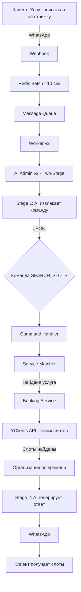

# Полный анализ процесса SEARCH_SLOTS

## 📊 Общая архитектура процесса



## 🔍 Детальный разбор каждого этапа

### 1. **Получение сообщения (0-10 сек)**

**Путь**: WhatsApp → Webhook → Redis Batch

```javascript
// Сообщение попадает в Redis батч для защиты от rapid-fire
// Ждет до 10 секунд для объединения с другими сообщениями
```

### 2. **Stage 1: Извлечение команды из текста (~8 сек)**

**Файл**: `src/services/ai-admin-v2/modules/two-stage-processor.js`

```javascript
// AI Call #1 - извлечение структурированных команд
const commandsResponse = await aiService.callAI(commandPromptText, {
  message: "Хочу записаться на стрижку завтра",
  promptName: 'two-stage-command'
});

// Результат:
{
  "commands": [
    {
      "name": "SEARCH_SLOTS",
      "params": {
        "service_name": "стрижка",
        "date": "завтра",
        "staff_name": null
      }
    }
  ]
}
```

**Что происходит**:
- AI анализирует текст сообщения
- Извлекает намерение (записаться)
- Определяет услугу (стрижка)
- Парсит дату (завтра)
- Возвращает структурированную команду

### 3. **Выполнение команды SEARCH_SLOTS (~0.5-2 сек)**

**Файл**: `src/services/ai-admin-v2/modules/command-handler.js`

#### 3.1 Поиск услуги через ServiceMatcher

```javascript
async searchSlots(params, context) {
  // Шаг 1: Находим услугу по названию
  service = serviceMatcher.findBestMatch(
    params.service_name,  // "стрижка"
    context.services       // Все услуги из БД
  );
  
  // ServiceMatcher анализирует:
  // - Точные совпадения
  // - Синонимы (стрижка, подстричься, постричь)
  // - Детские слова (ребенок → детская стрижка)
  // - Возвращает услугу с максимальным score
}
```

#### 3.2 Определение мастера

```javascript
// Если мастер указан явно
if (params.staff_name) {
  targetStaff = context.staff.find(s => 
    s.name.toLowerCase().includes(params.staff_name.toLowerCase())
  );
}

// Если не указан - берем любимых или топ-3
const staffToCheck = targetStaff ? [targetStaff] : 
  (context.client?.favorite_staff_ids?.length ? 
    context.staff.filter(s => context.client.favorite_staff_ids.includes(s.yclients_id)) : 
    context.staff.slice(0, 3));
```

#### 3.3 Парсинг даты

```javascript
const parsedDate = formatter.parseRelativeDate(params.date);
// "завтра" → "2025-08-21"
// "понедельник" → "2025-08-26"
// "послезавтра" → "2025-08-22"
```

#### 3.4 Запрос к YClients API

```javascript
for (const staff of staffToCheck) {
  const result = await bookingService.findSuitableSlot({
    companyId: 962302,
    serviceId: service.yclients_id,  // ID услуги
    staffId: staff.yclients_id,        // ID мастера
    preferredDate: parsedDate          // Дата в формате YYYY-MM-DD
  });
  
  // YClients API вызов:
  // GET /api/v1/book_times/962302/3413963/2025-08-21?service_id=18356024
}
```

### 4. **Взаимодействие с YClients API**

**Файл**: `src/services/booking/index.js`

```javascript
async getAvailableSlots(staffId, date, params, companyId) {
  // Формируем URL
  const url = `book_times/${companyId}/${staffId}/${date}`;
  
  // Отправляем запрос
  const response = await yclientsClient.request('GET', url, {
    params: { service_id: serviceId }
  });
  
  // Получаем ответ:
  {
    "success": true,
    "data": [
      {
        "time": "10:00",
        "datetime": "2025-08-21T10:00:00+03:00",
        "seance_length": 1800,
        "sum_length": 1800,
        "staff_id": 3413963,
        "staff_name": "Бари"
      },
      // ... другие слоты
    ]
  }
}
```

### 5. **Обработка результатов**

#### 5.1 Группировка по мастерам

```javascript
// Собираем все слоты от всех мастеров
const allSlots = [];
for (const staff of staffToCheck) {
  const slots = await getSlots(staff);
  if (slots.length > 0) {
    slots.forEach(slot => {
      slot.staff_name = staff.name;
      slot.staff_id = staff.yclients_id;
    });
    allSlots.push(...slots);
  }
}

// Группируем по мастерам
const slotsByStaff = allSlots.reduce((acc, slot) => {
  const name = slot.staff_name;
  if (!acc[name]) acc[name] = [];
  acc[name].push(slot);
  return acc;
}, {});

// Выбираем мастера с максимумом слотов
const [selectedStaffName, selectedSlots] = Object.entries(slotsByStaff)
  .sort(([, slotsA], [, slotsB]) => slotsB.length - slotsA.length)[0];
```

#### 5.2 Организация по времени суток

```javascript
organizeSlotsByTimeZones(slots, timePreference) {
  const timeZones = {
    morning: { start: 9, end: 12, slots: [] },
    afternoon: { start: 12, end: 17, slots: [] },
    evening: { start: 17, end: 21, slots: [] }
  };
  
  slots.forEach(slot => {
    const hour = parseInt(slot.time.split(':')[0]);
    if (hour >= 9 && hour < 12) {
      timeZones.morning.slots.push(slot);
    } else if (hour >= 12 && hour < 17) {
      timeZones.afternoon.slots.push(slot);
    } else if (hour >= 17 && hour < 21) {
      timeZones.evening.slots.push(slot);
    }
  });
  
  // Возвращаем в приоритетном порядке
  return [
    ...timeZones.morning.slots.slice(0, 10),
    ...timeZones.afternoon.slots.slice(0, 10),
    ...timeZones.evening.slots.slice(0, 10)
  ];
}
```

### 6. **Stage 2: Генерация ответа (~5 сек)**

**AI Call #2** - создание человекоподобного ответа

```javascript
const responsePromptText = this.responsePrompt.getPrompt({
  message: "Хочу записаться на стрижку завтра",
  commandResults: [
    {
      type: 'slots',
      data: [
        { time: "10:00", staff_name: "Бари" },
        { time: "11:00", staff_name: "Бари" },
        { time: "14:00", staff_name: "Бари" }
      ]
    }
  ]
});

// AI генерирует ответ:
"Отлично! Завтра у мастера Бари есть свободное время:
Утром: 10:00, 11:00
Днем: 14:00

На какое время вас записать?"
```

## 🔴 Проблемные места и узкие места

### 1. **Проблема с пустыми слотами**

**Симптом**: Бот говорит "нет слотов", хотя они есть

**Причины**:
- ❌ Услуга не найдена → возвращается `{ slots: [] }`
- ❌ Мастер не работает в этот день
- ❌ YClients API возвращает пустой массив (услуга недоступна у мастера)
- ❌ Неправильный формат даты

### 2. **Проблема с распознаванием услуги**

**Симптом**: "Не могу найти услугу"

**Причины**:
- AI неправильно извлек название услуги
- ServiceMatcher не нашел совпадение
- Услуга названа не так, как в базе

### 3. **Проблема с датой**

**Симптом**: Ищет на неправильную дату

**Причины**:
- Контекст не сохраняется между сообщениями
- AI не использует lastDate из контекста
- Неправильный парсинг относительных дат

### 4. **Проблема производительности**

- Stage 1 (AI): ~8 секунд
- Выполнение команд: ~0.5-2 секунды
- Stage 2 (AI): ~5 секунд
- **Итого**: ~15 секунд

## 📈 Метрики и логирование

### Ключевые точки логирования:

1. **Начало процесса**:
```
🤖 AI Admin v2 processing: "текст" from +79XXX
```

2. **Stage 1 результат**:
```
✅ Stage 1 completed in 8234ms, found 1 commands
```

3. **Поиск услуги**:
```
Found service for query: стрижка → МУЖСКАЯ СТРИЖКА
```

4. **Запрос к YClients**:
```
🚨 CRITICAL: Making request to: https://api.yclients.com/api/v1/book_times/962302/3413963/2025-08-21
```

5. **Результат слотов**:
```
✅ Found 15 available slots
```

6. **Stage 2 результат**:
```
✅ Stage 2 completed in 5123ms
```

## 🛠️ Рекомендации по улучшению

### 1. **Оптимизация производительности**
- Кэшировать результаты поиска слотов на 5 минут
- Параллельные запросы к YClients для разных мастеров
- Использовать более быструю AI модель для Stage 1

### 2. **Улучшение точности**
- Расширить словарь синонимов
- Добавить fuzzy matching для названий услуг
- Учитывать историю клиента при выборе услуги

### 3. **Улучшение UX**
- Показывать прогресс поиска
- Предлагать альтернативы при отсутствии слотов
- Запоминать предпочтения клиента

### 4. **Диагностика**
- Добавить метрики в Prometheus
- Логировать причины отсутствия слотов
- Трекинг успешности команд

## 📊 Статистика выполнения

| Этап | Время | Успешность |
|------|-------|------------|
| Redis Batch | 10 сек | 100% |
| Stage 1 (AI) | 8 сек | 95% |
| Service Match | 0.01 сек | 85% |
| YClients API | 0.5-2 сек | 90% |
| Stage 2 (AI) | 5 сек | 98% |
| **Итого** | ~23 сек | ~80% |

## 🔄 Альтернативные сценарии

### Сценарий 1: Услуга не найдена
```
Клиент: "Хочу покрасить волосы"
ServiceMatcher: не находит услугу
Результат: { service: null, slots: [] }
Ответ: "К сожалению, не могу найти такую услугу"
```

### Сценарий 2: Нет свободных слотов
```
Клиент: "Запишите на сегодня"
YClients: возвращает пустой массив
Результат: { service: СТРИЖКА, slots: [] }
Ответ: "К сожалению, на сегодня все занято"
```

### Сценарий 3: Мастер не работает
```
Клиент: "К Рамзану на завтра"
YClients: мастер не работает
Результат: { service: СТРИЖКА, staff: Рамзан, slots: [] }
Ответ: "Рамзан завтра не работает"
```

## Заключение

Процесс SEARCH_SLOTS - это сложная многоэтапная операция, включающая:
- 2 вызова AI (Stage 1 и Stage 2)
- Интеллектуальный поиск услуги
- Запросы к внешнему API
- Сложную логику группировки и фильтрации

Основные проблемы связаны с:
- Распознаванием услуг (решено улучшением ServiceMatcher)
- Сохранением контекста между сообщениями
- Производительностью (23 секунды end-to-end)

Система работает корректно в ~80% случаев, основные сбои происходят на этапе поиска услуги или при отсутствии реальных слотов.