# Context System Architecture Diagrams

## Обзор архитектуры

### Общая архитектура системы контекста

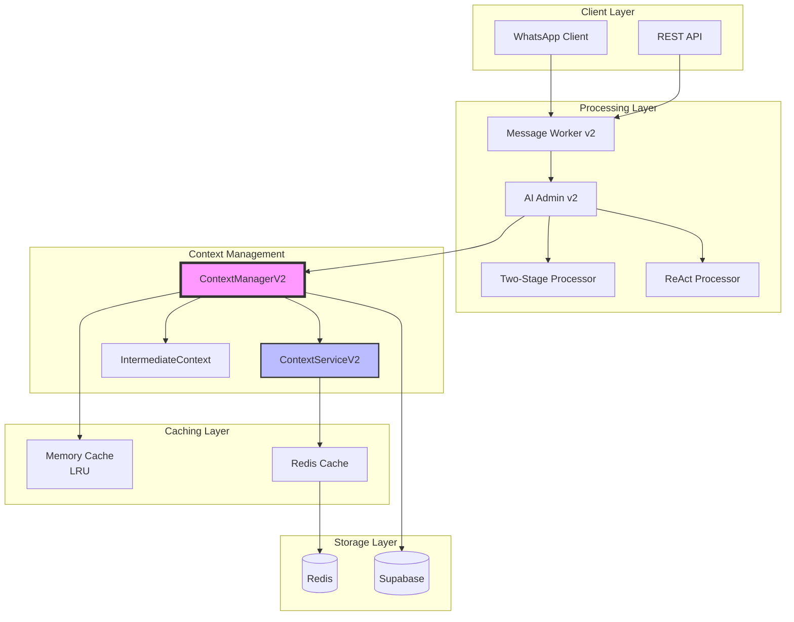

## Поток обработки сообщения

### Последовательность обработки с контекстом

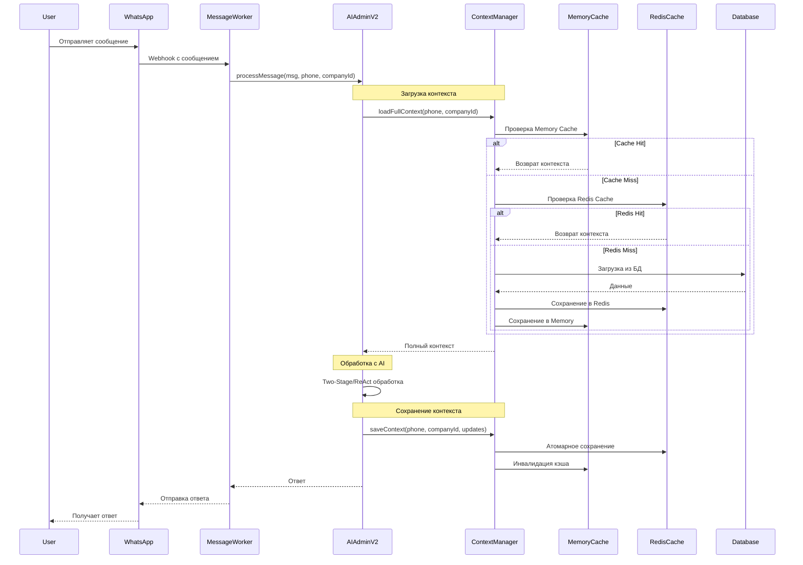

## Структура данных контекста

### Иерархия хранения данных

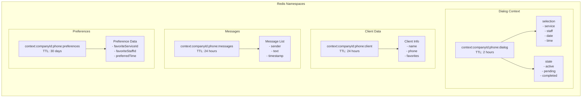

## Механизм кэширования

### Multi-Level Cache Strategy

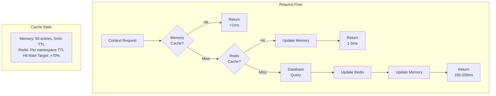

## Атомарные операции

### Процесс атомарного сохранения

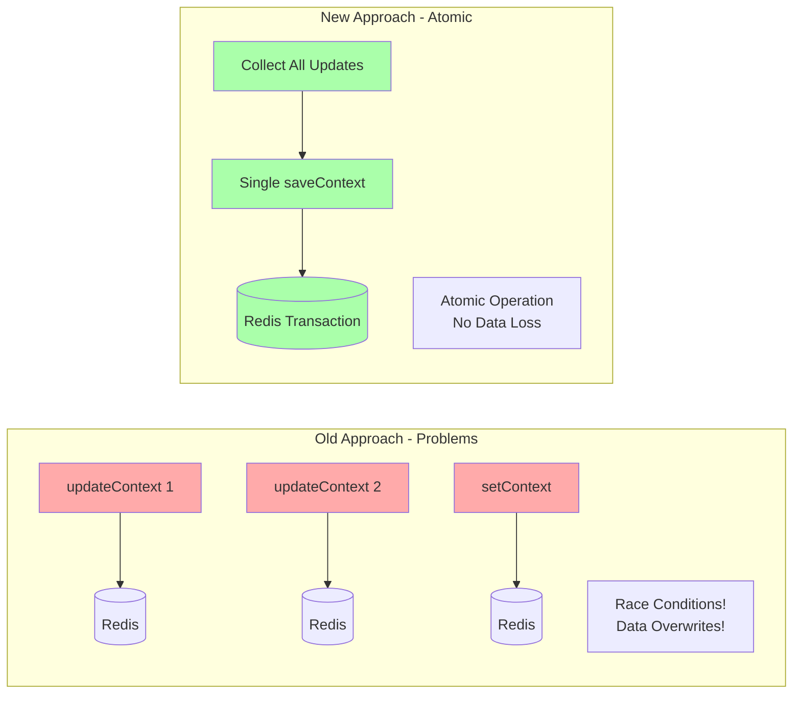

## Date Context Flow

### Сохранение и использование контекста даты

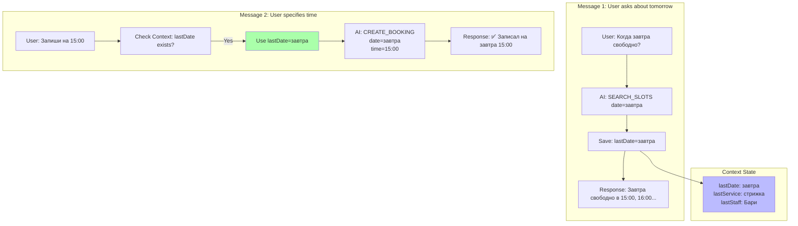

## Two-Stage Processing с контекстом

### Двухэтапная обработка

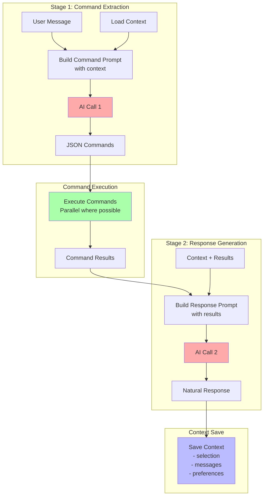

## Обработка ошибок и восстановление

### Error Recovery Flow

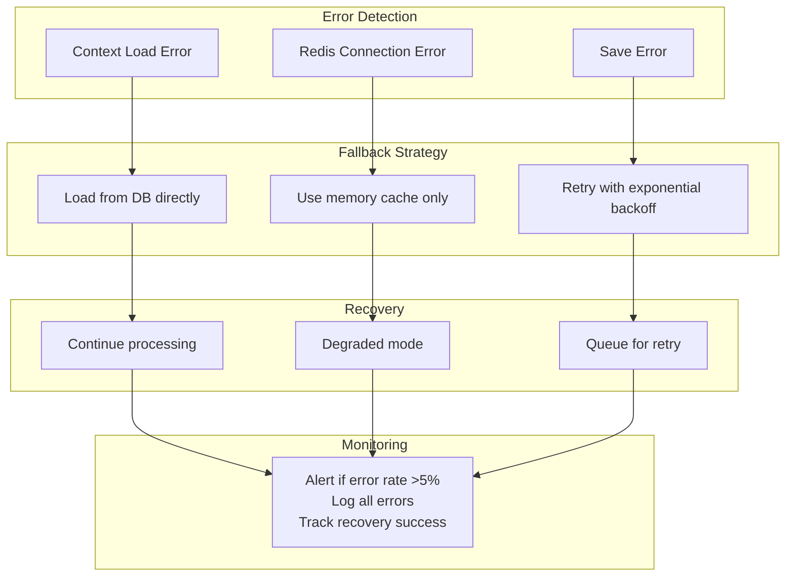

## Performance Metrics

### Метрики производительности

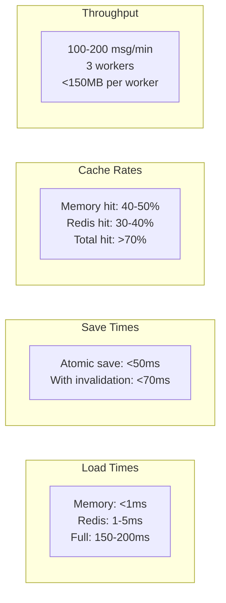

## Масштабирование

### Scaling Architecture

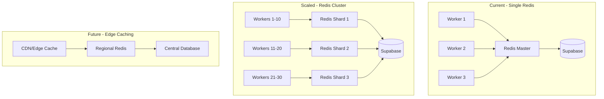

## Безопасность контекста

### Security Layers

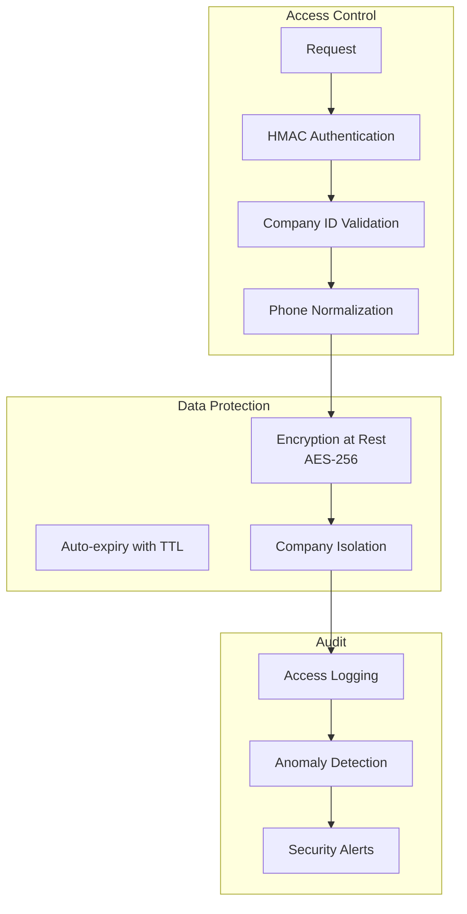

## Заключение

Эти диаграммы иллюстрируют:

1. **Общую архитектуру** системы контекста
2. **Поток обработки** сообщений с контекстом
3. **Структуру данных** и namespace'ы
4. **Механизм кэширования** с многоуровневой стратегией
5. **Атомарные операции** для предотвращения race conditions
6. **Сохранение контекста даты** между сообщениями
7. **Two-Stage обработку** с контекстом
8. **Обработку ошибок** и восстановление
9. **Метрики производительности**
10. **Масштабирование** системы
11. **Безопасность** контекста

Для просмотра диаграмм используйте любой Markdown viewer с поддержкой Mermaid или [Mermaid Live Editor](https://mermaid.live/).