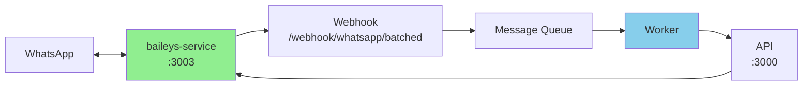

# Baileys Standalone Architecture

## Overview

В режиме `BAILEYS_STANDALONE` WhatsApp сессия управляется исключительно отдельным процессом baileys-service, что предотвращает конфликты и обеспечивает стабильное соединение.

## Архитектура



### Компоненты

#### 1. baileys-service (PM2: baileys-whatsapp)
**Роль**: Единственный владелец WhatsApp сессии

**Файл**: `scripts/baileys-service.js`

**Функции**:
- Создает и поддерживает Baileys сессию
- Получает входящие сообщения от WhatsApp
- Форвардит сообщения на webhook
- Предоставляет API endpoints:
  - `GET /health` - статус соединения
  - `POST /send` - отправка сообщений

**Порт**: 3003

#### 2. API Server (PM2: ai-admin-api)
**Роль**: Координатор и прокси

**Файл**: `src/api/index.js`

**Функции**:
- Принимает webhooks с сообщениями
- Управляет очередями
- Проксирует запросы отправки к baileys-service
- НЕ создает WhatsApp сессии (в STANDALONE режиме)

**Порт**: 3000

#### 3. Worker (PM2: ai-admin-worker-v2)
**Роль**: Обработка бизнес-логики

**Файл**: `src/workers/message-worker-v2.js`

**Функции**:
- Обрабатывает сообщения из очереди
- Вызывает AI для генерации ответов
- Отправляет ответы через API → baileys-service

## Конфигурация

### Обязательные переменные окружения

```bash
# .env файл
BAILEYS_STANDALONE=true    # Включает standalone режим
BAILEYS_PORT=3003          # Порт для baileys-service
COMPANY_ID=962302          # ID компании по умолчанию
```

### PM2 Configuration

```javascript
// ecosystem.baileys.config.js
{
  name: 'baileys-whatsapp',
  script: './scripts/baileys-service.js',
  env: {
    NODE_ENV: 'production',
    BAILEYS_STANDALONE: 'true',
    BAILEYS_PORT: 3003,
    COMPANY_ID: '962302'
  }
}
```

## Поток сообщений

### Входящее сообщение
```
1. WhatsApp → baileys-service (получает через Baileys events)
2. baileys-service → webhook /webhook/whatsapp/batched (HTTP POST)
3. webhook → Redis Queue (добавляет в очередь)
4. Worker → берет из очереди
5. Worker → AI processing
6. Worker → API /api/whatsapp/sessions/{companyId}/send
7. API → baileys-service /send (proxy)
8. baileys-service → WhatsApp
```

### Код отправки сообщения

#### Worker отправляет через API:
```javascript
// src/integrations/whatsapp/api-client.js
const response = await axios.post(
  `${this.apiUrl}/api/whatsapp/sessions/${companyId}/send`,
  { phone, message }
);
```

#### API проксирует к baileys-service:
```javascript
// src/api/routes/whatsapp-sessions-improved.js
if (process.env.BAILEYS_STANDALONE === 'true') {
  const response = await axios.post(
    `http://localhost:${baileysPort}/send`,
    { phone, message }
  );
  return res.json({ success: true, messageId: response.data.messageId });
}
```

#### baileys-service отправляет в WhatsApp:
```javascript
// scripts/baileys-service.js
app.post('/send', async (req, res) => {
  const { phone, message } = req.body;
  const result = await pool.sendMessage(companyId, phone, message);
  res.json({ success: true, messageId: result?.key?.id });
});
```

## Ключевые изменения для STANDALONE

### 1. WhatsApp Manager
```javascript
// src/integrations/whatsapp/whatsapp-manager-unified.js
if (process.env.BAILEYS_STANDALONE === 'true') {
  logger.info('⚠️ Skipping default company initialization (BAILEYS_STANDALONE mode)');
  // НЕ создаем сессию в API
}
```

### 2. Session Pool
```javascript
// src/integrations/whatsapp/session-pool.js

// Новый метод для получения существующей сессии
getSession(companyId) {
  const validatedId = this.validateCompanyId(companyId);
  return this.sessions.get(validatedId);
}

// sendMessage не создает новые сессии
async sendMessage(companyId, phone, message) {
  const session = this.sessions.get(validatedId);
  if (!session || !session.user) {
    throw new Error(`WhatsApp not connected. Please ensure baileys-service is running.`);
  }
  // Отправка через существующую сессию
}
```

### 3. Health Checks
```javascript
// Пассивный мониторинг вместо активного переподключения
startHealthChecks() {
  logger.info('Health checks initialized (passive mode to prevent error 440)');
  setInterval(() => {
    const activeCount = Array.from(this.sessions.values()).filter(s => s.user).length;
    logger.debug(`Session pool status: ${activeCount}/${this.sessions.size} active sessions`);
  }, this.healthCheckInterval);
}
```

## Преимущества STANDALONE архитектуры

1. **Изоляция**: WhatsApp соединение изолировано от бизнес-логики
2. **Стабильность**: Нет конфликтов между процессами
3. **Масштабируемость**: Можно запускать несколько API/Worker, но только один baileys
4. **Отказоустойчивость**: При падении API, WhatsApp остается подключенным
5. **Простота отладки**: Четкое разделение ответственности

## Мониторинг

### Проверка статуса
```bash
# Статус всех процессов
pm2 status

# Здоровье baileys-service
curl http://localhost:3003/health

# Логи
pm2 logs baileys-whatsapp --lines 50
```

### Метрики здоровья
```json
{
  "service": "baileys-whatsapp",
  "companyId": "962302",
  "connected": true,
  "phoneNumber": "79936363848:37",
  "metrics": {
    "totalSessions": 1,
    "activeConnections": 1,
    "messagesSent": 150,
    "messagesReceived": 200,
    "errors": 0
  }
}
```

## Troubleshooting

### Ошибка 440 (connectionReplaced)
**Причина**: Множественные попытки подключения с одним номером

**Проверка**:
1. Убедитесь, что `BAILEYS_STANDALONE=true` установлен
2. Проверьте, что только baileys-service создает сессии
3. Проверьте логи на предмет дублирующих подключений

**Решение**:
```bash
# Перезапуск с правильными флагами
pm2 restart baileys-whatsapp --update-env
pm2 restart ai-admin-api --update-env
```

### Worker не может отправить сообщения
**Причина**: API не может найти сессию или не может проксировать

**Проверка**:
```bash
# Проверить, работает ли baileys-service
curl http://localhost:3003/health

# Проверить логи worker
pm2 logs ai-admin-worker-v2 --lines 50 | grep "Failed to send"
```

**Решение**:
1. Убедитесь, что baileys-service запущен
2. Проверьте, что порт 3003 доступен
3. Проверьте переменную BAILEYS_PORT

### Сообщения не доходят до worker
**Причина**: Проблема с webhook или очередью

**Проверка**:
```bash
# Проверить получение сообщений
pm2 logs baileys-whatsapp | grep "New message from"

# Проверить форвардинг на webhook
pm2 logs baileys-whatsapp | grep "Message forwarded to webhook"

# Проверить обработку worker
pm2 logs ai-admin-worker-v2 | grep "Processing message"
```

## Деплой

### Первый запуск
```bash
# 1. Установить переменные окружения
echo "BAILEYS_STANDALONE=true" >> .env
echo "BAILEYS_PORT=3003" >> .env

# 2. Запустить baileys-service
pm2 start ecosystem.baileys.config.js

# 3. Дождаться подключения
pm2 logs baileys-whatsapp

# 4. Запустить остальные сервисы
pm2 start ecosystem.config.js
```

### Обновление
```bash
# 1. Pull изменения
git pull

# 2. Перезапуск с обновлением окружения
pm2 restart baileys-whatsapp --update-env
pm2 restart ai-admin-api --update-env
pm2 restart ai-admin-worker-v2
```

## Важные замечания

1. **НИКОГДА** не создавайте сессии в нескольких местах
2. **ВСЕГДА** используйте BAILEYS_STANDALONE=true в продакшене
3. **НЕ** используйте агрессивные health checks для WhatsApp
4. **ПРОВЕРЯЙТЕ** логи baileys-service при проблемах с доставкой
5. **МОНИТОРЬТЕ** метрики через /health endpoint