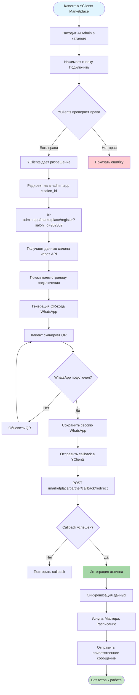
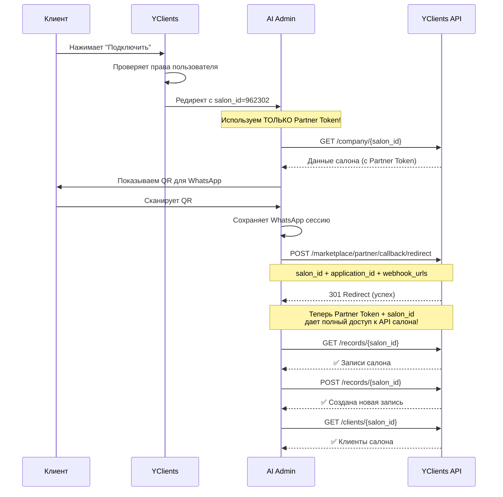
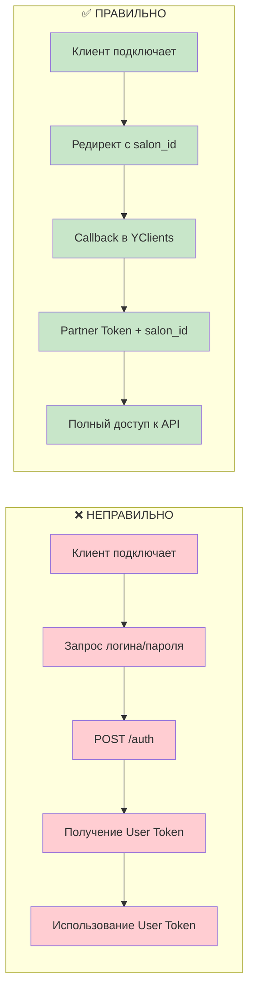
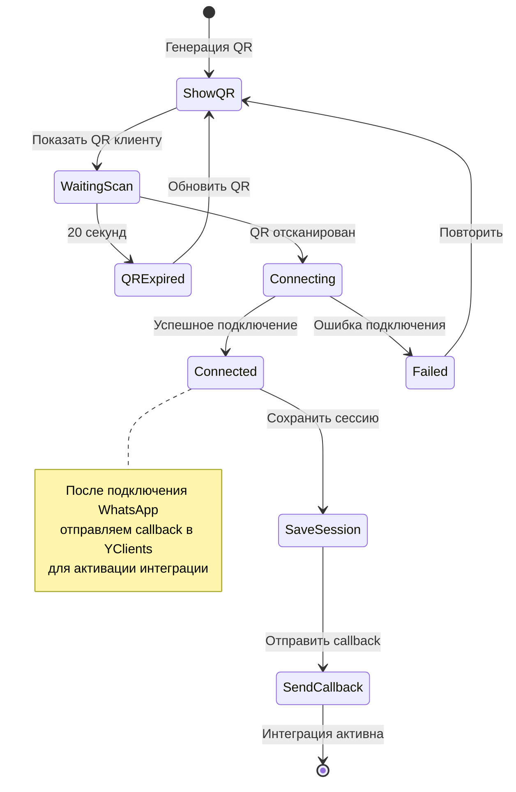
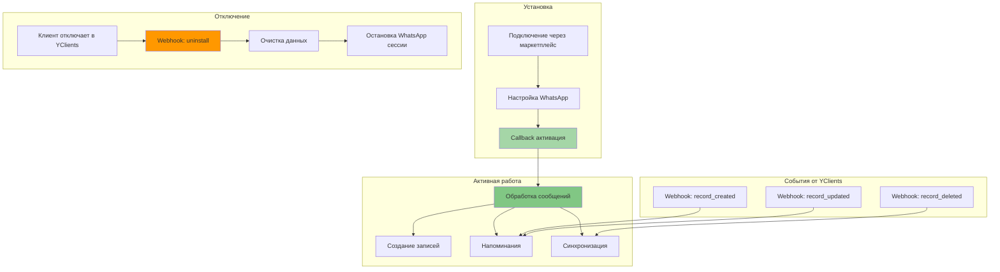
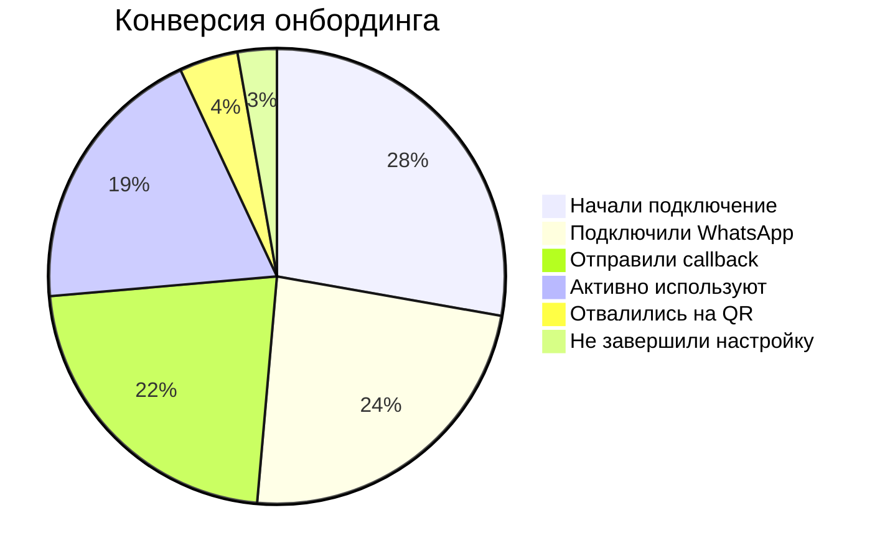
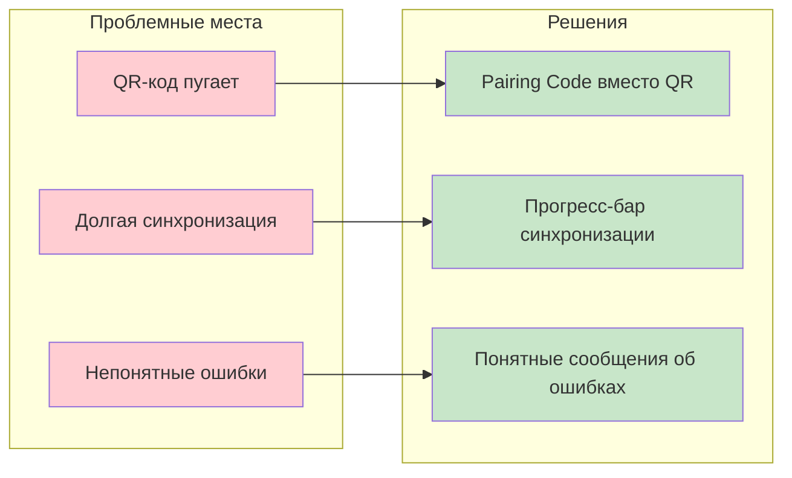

# 📊 YClients Marketplace Onboarding Flow Diagram

## 🔄 Полный процесс подключения

## 🔐 Авторизация и доступ к API

## 🚫 Что НЕ происходит (распространенные заблуждения)

## 📱 WhatsApp подключение детально

## 🔄 Жизненный цикл интеграции

## 📈 Метрики и конверсия

## 🎯 Ключевые точки оптимизации

---

*Создано: 02.10.2025*
*Версия: 1.0*