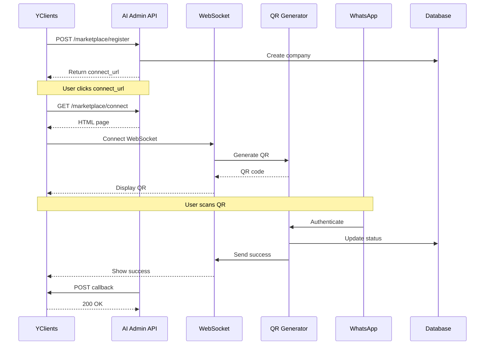

# 🚀 YClients Marketplace Integration - Полная документация

## 📋 Содержание

1. [Обзор системы](#обзор-системы)
2. [Архитектура](#архитектура)
3. [Установка и настройка](#установка-и-настройка)
4. [API Reference](#api-reference)
5. [WebSocket интеграция](#websocket-интеграция)
6. [Безопасность](#безопасность)
7. [База данных](#база-данных)
8. [Процесс подключения](#процесс-подключения)
9. [Мониторинг и логирование](#мониторинг-и-логирование)
10. [Troubleshooting](#troubleshooting)

## 🎯 Обзор системы

AI Admin Marketplace Integration - это полнофункциональная интеграция с маркетплейсом YClients, позволяющая салонам красоты подключать WhatsApp бота для автоматизации записи клиентов.

### Ключевые возможности

- ✅ Автоматическая регистрация салонов из YClients
- ✅ QR-код подключение WhatsApp через веб-интерфейс
- ✅ Real-time обновления через WebSocket
- ✅ Автоматическая синхронизация данных
- ✅ Полная валидация и защита данных
- ✅ Rate limiting и защита от DDoS
- ✅ Multi-tenant архитектура

### Текущий статус

**Версия:** 1.0.0
**Статус:** Production Ready
**Оценка безопасности:** 9/10
**Дата последнего обновления:** 16 января 2025

## 🏗️ Архитектура

### Компоненты системы

```
┌─────────────────┐
│   YClients      │
│  Marketplace    │
└────────┬────────┘
         │
    [OAuth/API]
         │
┌────────▼────────┐
│   AI Admin      │
│   API Server    │
├─────────────────┤
│ • Express.js    │
│ • Socket.io     │
│ • JWT Auth      │
└────────┬────────┘
         │
    [WebSocket]
         │
┌────────▼────────┐
│  WhatsApp Bot   │
│   (Baileys)     │
└────────┬────────┘
         │
    [Messages]
         │
┌────────▼────────┐
│    Clients      │
└─────────────────┘
```

### Технологический стек

- **Backend:** Node.js, Express.js
- **WebSocket:** Socket.io
- **WhatsApp:** Baileys/WhiskeySockets
- **База данных:** PostgreSQL (Supabase)
- **Кэш:** Redis
- **Аутентификация:** JWT
- **Валидация:** Custom validators

## 🛠️ Установка и настройка

### Требования

- Node.js >= 16.x
- PostgreSQL >= 13
- Redis >= 6.x
- PM2 (для production)

### Переменные окружения

```bash
# Обязательные
YCLIENTS_API_KEY=your_yclients_api_key
JWT_SECRET=your_secret_key_min_32_chars
SUPABASE_URL=https://your-project.supabase.co
SUPABASE_KEY=your_supabase_service_key
REDIS_URL=redis://localhost:6379

# Опциональные
NODE_ENV=production
PORT=3000
```

### Установка

```bash
# Клонирование репозитория
git clone https://github.com/vosarsen/ai_admin_v2.git
cd ai_admin_v2

# Установка зависимостей
npm install

# Настройка окружения
cp .env.example .env
# Отредактируйте .env файл

# Запуск миграций БД
npm run migrate

# Запуск в development
npm run dev

# Запуск в production
npm run build
pm2 start ecosystem.config.js
```

## 📚 API Reference

### Базовый URL

```
Production: https://ai-admin.app
Development: http://localhost:3000
```

### Аутентификация

Все защищенные endpoints требуют API ключ в заголовке:

```http
X-API-Key: your_api_key_here
```

### Endpoints

#### 1. Регистрация компании

```http
POST /marketplace/register
Content-Type: application/json

{
  "salon_id": 962302,
  "phone": "79001234567",
  "email": "salon@example.com"
}
```

**Response:**
```json
{
  "success": true,
  "company_id": 1,
  "salon_id": 962302,
  "api_key": "sk_...",
  "connect_url": "/marketplace/connect?token=...&company=1&salon=962302"
}
```

**Коды ошибок:**
- `400` - Некорректные параметры
- `409` - Компания уже существует
- `500` - Внутренняя ошибка

#### 2. Страница подключения WhatsApp

```http
GET /marketplace/connect?token={token}&company={id}&salon={salon_id}
```

Отображает HTML страницу с QR-кодом для подключения WhatsApp.

#### 3. Получение QR-кода

```http
GET /marketplace/qr/{token}
```

**Response:**
```json
{
  "success": true,
  "qr": "2@ABCdef123...",
  "expires_in": 20
}
```

#### 4. Статус подключения

```http
GET /marketplace/status/{companyId}
```

**Response:**
```json
{
  "success": true,
  "company_id": 1,
  "whatsapp_connected": true,
  "whatsapp_phone": "79001234567",
  "integration_status": "active",
  "connected_at": "2025-01-16T10:00:00Z"
}
```

#### 5. Callback для YClients

```http
POST /marketplace/callback
Content-Type: application/json

{
  "salon_id": 962302,
  "company_id": 1,
  "status": "connected",
  "whatsapp_phone": "79001234567",
  "api_key": "sk_..."
}
```

#### 6. Webhook от YClients

```http
POST /marketplace/webhook/{companyId}
Content-Type: application/json

{
  "type": "booking_created",
  "data": {
    "id": 123,
    "client_id": 456,
    "service_id": 789,
    "datetime": "2025-01-20T15:00:00Z"
  }
}
```

#### 7. Статистика подключений

```http
GET /marketplace/companies
X-API-Key: admin_key
```

**Response:**
```json
{
  "success": true,
  "stats": {
    "total": 100,
    "connected": 85
  }
}
```

## 🔌 WebSocket интеграция

### Подключение

```javascript
const socket = io('/marketplace', {
  auth: {
    token: 'your_token_here'
  },
  transportOptions: {
    polling: {
      extraHeaders: {
        'Authorization': 'Bearer your_token_here'
      }
    }
  },
  query: {
    companyId: '1'
  }
});
```

### События

#### Client → Server

- `request-qr` - Запрос нового QR-кода
- `disconnect` - Отключение

#### Server → Client

- `qr-update` - Обновление QR-кода
  ```json
  {
    "qr": "2@ABCdef...",
    "expiresIn": 20
  }
  ```

- `whatsapp-connected` - Успешное подключение
  ```json
  {
    "success": true,
    "phone": "79001234567",
    "companyId": 1,
    "message": "WhatsApp успешно подключен!"
  }
  ```

- `error` - Ошибка
  ```json
  {
    "message": "Описание ошибки"
  }
  ```

### Rate Limiting

- **Лимит:** 5 подключений за 60 секунд с одного IP
- **Автоочистка:** Каждые 5 минут
- **Ответ при превышении:** Instant disconnect с ошибкой

## 🔐 Безопасность

### Реализованные меры защиты

1. **JWT Authentication**
   - Токены с ограниченным сроком действия (24 часа)
   - Обязательная проверка JWT_SECRET из env
   - Токены передаются в headers, не в URL

2. **Валидация данных**
   - Все входные данные валидируются
   - Санитизация строк (max 255 символов)
   - Проверка форматов email и телефонов
   - Защита от SQL injection через параметризованные запросы

3. **Rate Limiting**
   - WebSocket: 5 подключений/60 сек на IP
   - API: 30 запросов/минуту на endpoint
   - Автоматическая блокировка при превышении

4. **CORS & Origin проверка**
   - Белый список разрешенных доменов
   - Проверка origin для WebSocket в production

5. **Защита от утечек памяти**
   - Автоматическая очистка сессий
   - Удаление event listeners
   - Периодическая очистка rate limiter

### Рекомендации по безопасности

```bash
# Генерация безопасного JWT_SECRET
openssl rand -base64 32

# Настройка HTTPS (Nginx)
server {
    listen 443 ssl http2;
    server_name ai-admin.app;

    ssl_certificate /path/to/cert.pem;
    ssl_certificate_key /path/to/key.pem;

    location / {
        proxy_pass http://localhost:3000;
        proxy_http_version 1.1;
        proxy_set_header Upgrade $http_upgrade;
        proxy_set_header Connection 'upgrade';
        proxy_set_header X-Real-IP $remote_addr;
    }
}
```

## 💾 База данных

### Схема таблицы companies

```sql
CREATE TABLE companies (
  id SERIAL PRIMARY KEY,
  yclients_id INTEGER UNIQUE NOT NULL,
  company_id INTEGER,
  title VARCHAR(255),
  phone VARCHAR(20),
  email VARCHAR(255),
  address TEXT,
  timezone VARCHAR(50) DEFAULT 'Europe/Moscow',
  whatsapp_enabled BOOLEAN DEFAULT false,
  whatsapp_connected BOOLEAN DEFAULT false,
  whatsapp_phone VARCHAR(20),
  whatsapp_connected_at TIMESTAMPTZ,
  ai_enabled BOOLEAN DEFAULT true,
  sync_enabled BOOLEAN DEFAULT true,
  integration_status VARCHAR(50) DEFAULT 'pending',
  api_key VARCHAR(255),
  raw_data JSONB,
  created_at TIMESTAMPTZ DEFAULT NOW(),
  updated_at TIMESTAMPTZ DEFAULT NOW()
);

CREATE INDEX idx_companies_yclients_id ON companies(yclients_id);
CREATE INDEX idx_companies_whatsapp_connected ON companies(whatsapp_connected);
```

### Redis структура

```
marketplace:token:{token} → companyId (TTL: 24h)
marketplace:company:{companyId}:token → token (TTL: 24h)
marketplace:qr:{companyId} → {qr, generated_at} (TTL: 20s)
```

## 📱 Процесс подключения

### Пошаговый процесс

1. **Регистрация в маркетплейсе**
   - Салон устанавливает приложение в YClients
   - YClients отправляет данные на `/marketplace/register`
   - Создается компания в БД, генерируется API ключ

2. **Переход на страницу подключения**
   - Пользователь переходит по connect_url
   - Загружается HTML страница с инструкциями
   - Устанавливается WebSocket соединение

3. **Генерация QR-кода**
   - Baileys создает новую сессию WhatsApp
   - QR-код отправляется через WebSocket
   - Таймер обновления каждые 20 секунд

4. **Сканирование QR-кода**
   - Пользователь открывает WhatsApp на телефоне
   - Сканирует QR через "Связанные устройства"
   - WhatsApp авторизует подключение

5. **Подтверждение подключения**
   - Baileys получает событие подключения
   - Обновляется статус в БД
   - Отправляется callback в YClients
   - Запускается синхронизация данных

### Диаграмма процесса



## 📊 Мониторинг и логирование

### Логирование

Все события логируются с соответствующими уровнями:

```javascript
logger.info('✅ Компания зарегистрирована', { companyId, salonId });
logger.warn('Rate limit превышен для IP:', clientIp);
logger.error('Ошибка валидации токена:', error);
```

### Метрики для мониторинга

- **Подключения WebSocket:** Количество активных соединений
- **Rate limit hits:** Количество превышений лимита
- **QR генерации:** Успешные/неуспешные генерации
- **WhatsApp подключения:** Успешные подключения в час
- **API латентность:** Время ответа endpoints

### PM2 мониторинг

```bash
# Статус процессов
pm2 status

# Логи в реальном времени
pm2 logs ai-admin-api

# Метрики
pm2 monit

# Web dashboard
pm2 web
```

## 🔧 Troubleshooting

### Частые проблемы и решения

#### 1. QR-код не генерируется

**Причина:** Проблема с Baileys сессией

**Решение:**
```bash
# Очистить сессии
rm -rf sessions/company_*

# Перезапустить сервис
pm2 restart ai-admin-api
```

#### 2. WebSocket не подключается

**Причина:** Неверная конфигурация Nginx

**Решение:**
```nginx
# Добавить в конфигурацию
proxy_set_header Upgrade $http_upgrade;
proxy_set_header Connection 'upgrade';
```

#### 3. Rate limit срабатывает слишком часто

**Причина:** Низкий лимит для production

**Решение:**
```javascript
// В marketplace-socket.js
this.RATE_LIMIT_MAX = 10; // Увеличить до 10
this.RATE_LIMIT_WINDOW = 60000; // За минуту
```

#### 4. JWT_SECRET ошибка

**Причина:** Не установлена переменная окружения

**Решение:**
```bash
# В .env файле
JWT_SECRET=your_very_long_secret_key_at_least_32_chars

# Проверить
echo $JWT_SECRET
```

### Диагностические команды

```bash
# Проверить подключение к Redis
redis-cli ping

# Проверить БД
psql $DATABASE_URL -c "SELECT COUNT(*) FROM companies;"

# Проверить логи
tail -f ~/.pm2/logs/ai-admin-api-out.log

# Проверить порты
netstat -tlnp | grep 3000

# Проверить процессы
ps aux | grep node
```

## 📝 Примеры кода

### Подключение из frontend

```javascript
// Инициализация подключения
async function connectWhatsApp(token, companyId) {
  const socket = io('/marketplace', {
    auth: { token },
    transportOptions: {
      polling: {
        extraHeaders: {
          'Authorization': `Bearer ${token}`
        }
      }
    },
    query: { companyId }
  });

  socket.on('connect', () => {
    console.log('Connected to server');
  });

  socket.on('qr-update', (data) => {
    // Отобразить QR-код
    displayQR(data.qr);
  });

  socket.on('whatsapp-connected', (data) => {
    // Показать успех
    showSuccess(data);
  });

  socket.on('error', (error) => {
    // Обработать ошибку
    handleError(error);
  });
}
```

### Проверка статуса из backend

```javascript
const MarketplaceService = require('./services/marketplace/marketplace-service');

async function checkCompanyStatus(companyId) {
  const service = new MarketplaceService();
  await service.init();

  const company = await service.getCompany(companyId);

  if (company.whatsapp_connected) {
    console.log(`✅ WhatsApp подключен: ${company.whatsapp_phone}`);
  } else {
    console.log('❌ WhatsApp не подключен');
  }

  return company;
}
```

## 🚀 Развертывание

### Production чеклист

- [ ] Установить все переменные окружения
- [ ] Настроить HTTPS сертификаты
- [ ] Настроить Nginx reverse proxy
- [ ] Настроить PM2 ecosystem
- [ ] Настроить логирование
- [ ] Настроить бэкапы БД
- [ ] Настроить мониторинг
- [ ] Проверить rate limits
- [ ] Проверить CORS настройки
- [ ] Запустить тесты безопасности

### Команды деплоя

```bash
# На локальной машине
git add .
git commit -m "Deploy: описание изменений"
git push origin main

# На сервере
cd /opt/ai-admin
git pull
npm install --production
npm run migrate
pm2 restart ecosystem.config.js
pm2 save

# Проверка
curl https://ai-admin.app/health
```

## 📞 Поддержка

**Email:** support@ai-admin.app
**Telegram:** @ai_admin_support
**GitHub Issues:** https://github.com/vosarsen/ai_admin_v2/issues

## 📄 Лицензия

MIT License - см. файл LICENSE

---

*Последнее обновление: 16 января 2025*
*Версия документации: 1.0.0*