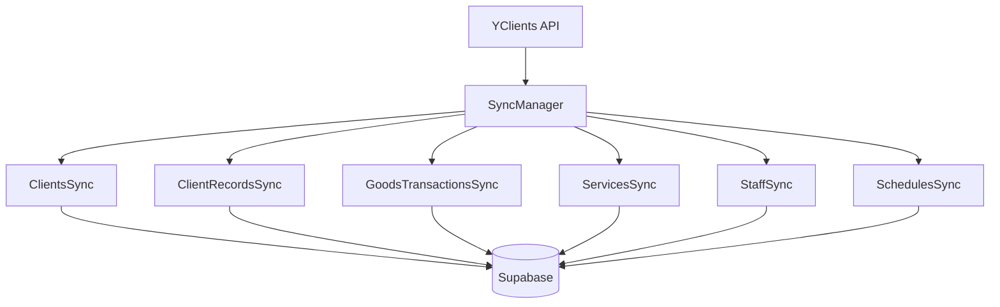

# 🔄 Система синхронизации YClients → Supabase v2.0

> **Последнее обновление**: 12 августа 2025  
> **Статус**: ✅ Production Ready  
> **Версия**: 2.0 (с полной синхронизацией визитов)

## 📋 Оглавление
- [Быстрый старт](#быстрый-старт)
- [Архитектура](#архитектура)
- [Автоматическая синхронизация](#автоматическая-синхронизация)
- [Ручное управление](#ручное-управление)
- [Мониторинг](#мониторинг)
- [Troubleshooting](#troubleshooting)

## 🚀 Быстрый старт

### Проверить статус синхронизации
```bash
node scripts/manual-sync.js status
```

### Запустить полную синхронизацию
```bash
# С визитами (рекомендуется)
SYNC_CLIENT_VISITS=true node scripts/manual-sync.js clients

# Без визитов (быстро, только базовые данные)
node scripts/manual-sync.js clients
```

### Проверить данные клиента
```bash
node scripts/check-client-data.js +79001234567
```

## 🏗️ Архитектура

### Компоненты системы



### Основные модули

| Модуль | Файл | Назначение |
|--------|------|------------|
| **SyncManager** | `sync-manager.js` | Координация всех синхронизаций |
| **ClientsSync** | `clients-sync-optimized.js` | Базовые данные клиентов |
| **ClientRecordsSync** | `client-records-sync.js` | История визитов |
| **GoodsTransactionsSync** | `goods-transactions-sync.js` | Товарные операции |
| **ServicesSync** | `services-sync.js` | Каталог услуг |
| **StaffSync** | `staff-sync.js` | Данные мастеров |
| **SchedulesSync** | `schedules-sync.js` | Расписания работы |

## ⏰ Автоматическая синхронизация

### Расписание (Moscow Time)

| Время | Что | Зачем |
|-------|-----|-------|
| **01:00** | Услуги | Обновление прайс-листа |
| **02:00** | Мастера | Актуальный список сотрудников |
| **03:00** | 🔥 **Клиенты + Визиты** | Полная история для персонализации |
| **Каждые 4ч** | Расписания | Свежие слоты для записи |
| **Каждые 15м** | Букинги | Оперативные изменения записей |
| **00:00 ВС** | Компания | Обновление настроек |

### Что происходит в 03:00 (главная синхронизация)

```javascript
// Автоматически выполняется каждую ночь
await syncClients({ 
  syncVisitHistory: true,  // ✅ Визиты включены
  maxVisitsSync: 10000     // ✅ Все клиенты
});
```

**Этапы:**
1. **Базовые данные** (14 сек) - имена, телефоны, total_spent
2. **История визитов** (5-10 мин) - все визиты за 2 года
3. **Товарные транзакции** (30 сек) - покупки товаров

## 🛠️ Ручное управление

### Команды синхронизации

```bash
# Полная синхронизация всего
node scripts/manual-sync.js full

# Только услуги
node scripts/manual-sync.js services

# Только мастера
node scripts/manual-sync.js staff

# Только клиенты БЕЗ визитов (быстро)
node scripts/manual-sync.js clients

# Клиенты С визитами (полная история)
SYNC_CLIENT_VISITS=true node scripts/manual-sync.js clients

# Только расписания
node scripts/manual-sync.js schedules

# Проверка статуса
node scripts/manual-sync.js status
```

### Специальные скрипты

```bash
# Синхронизация конкретного клиента
node scripts/sync-single-client.js +79001234567

# Проверка данных клиента
node scripts/check-client-data.js +79001234567

# Статистика по базе
node scripts/check-sync-status.js

# Мониторинг в реальном времени
node scripts/monitor-sync-progress.js
```

## 📊 Мониторинг

### Проверка последней синхронизации

```bash
# На сервере
pm2 logs ai-admin-worker-v2 | grep "sync completed"

# Локально через SSH
ssh ai-admin-server "pm2 logs ai-admin-worker-v2 --lines 100 | grep sync"
```

### SQL запросы для проверки

```sql
-- Общая статистика
SELECT 
  COUNT(*) as total_clients,
  COUNT(CASE WHEN visit_count > 0 THEN 1 END) as with_visits,
  COUNT(CASE WHEN array_length(visit_history, 1) > 0 THEN 1 END) as with_history,
  COUNT(CASE WHEN total_spent > 0 THEN 1 END) as paying_clients,
  MAX(last_sync_at) as last_sync
FROM clients;

-- Топ клиенты
SELECT 
  name, 
  phone, 
  visit_count, 
  total_spent,
  services_amount,
  goods_amount,
  loyalty_level,
  last_visit_date
FROM clients
WHERE visit_count > 0
ORDER BY total_spent DESC
LIMIT 10;

-- Проверка конкретного клиента
SELECT 
  name,
  visit_history,
  last_services
FROM clients
WHERE phone = '79001234567';
```

## 🔧 Troubleshooting

### Проблема: Данные не синхронизируются

**Проверки:**
1. Работает ли SyncManager?
   ```bash
   pm2 status
   pm2 logs ai-admin-worker-v2
   ```

2. Есть ли ошибки?
   ```bash
   pm2 logs ai-admin-worker-v2 --err
   ```

3. Правильные ли токены YClients?
   ```bash
   grep "YclientsClient initialized" ~/.pm2/logs/ai-admin-worker-v2-out.log
   ```

### Проблема: Визиты не синхронизируются

**Решение:**
```bash
# Проверить переменную окружения
grep SYNC_CLIENT_VISITS .env

# Должно быть
SYNC_CLIENT_VISITS=true

# Запустить вручную с визитами
SYNC_CLIENT_VISITS=true node scripts/manual-sync.js clients
```

### Проблема: Долгая синхронизация

**Оптимизации:**
1. Уменьшить количество клиентов для синхронизации визитов
2. Запускать в ночное время (меньше нагрузка)
3. Использовать параллельную синхронизацию

### Проблема: Данные перезаписываются пустыми

**Это исправлено!** В текущей версии:
- `visit_history` и `last_services` защищены от перезаписи пустыми массивами
- При синхронизации визитов данные обновляются полностью
- `total_spent` берется из YClients и не перезаписывается

## 📈 Метрики производительности

| Операция | Время | Объем |
|----------|-------|-------|
| Синхронизация клиентов | 14 сек | 1,097 записей |
| Синхронизация визитов | 10-15 мин | ~400 клиентов |
| Синхронизация услуг | 2 сек | 45 записей |
| Синхронизация мастеров | 1 сек | 3 записи |
| Синхронизация расписаний | 5 сек | 30 дней |

## 🔐 Безопасность

- Все токены хранятся в `.env` файле
- Используется Bearer + User токены для YClients
- Partner ID для расширенных прав
- Логи не содержат чувствительных данных

## 🎯 Ключевые особенности v2.0

1. **Полная история визитов** - синхронизируется каждую ночь
2. **Разделение финансов** - services_amount и goods_amount
3. **Защита от потери** - данные не затираются пустыми значениями
4. **Оптимизация** - батчинг и параллельная обработка
5. **Автоматизация** - полностью автономная работа

## 📝 Конфигурация

### Переменные окружения (.env)

```bash
# YClients API
YCLIENTS_BEARER_TOKEN=your_bearer_token
YCLIENTS_USER_TOKEN=your_user_token  
YCLIENTS_PARTNER_ID=8444

# Синхронизация
SYNC_CLIENT_VISITS=true  # Включить синхронизацию визитов
SYNC_BATCH_SIZE=50       # Размер батча
SYNC_MAX_CLIENTS=10000   # Максимум клиентов для визитов

# База данных
SUPABASE_URL=your_supabase_url
SUPABASE_KEY=your_supabase_key
```

### Настройка расписания

Файл: `src/sync/sync-manager.js`

```javascript
this.schedule = {
  services: '0 1 * * *',     // 01:00 ежедневно
  staff: '0 2 * * *',        // 02:00 ежедневно
  clients: '0 3 * * *',      // 03:00 ежедневно
  schedules: '0 */4 * * *',  // Каждые 4 часа
  bookings: '*/15 * * * *',  // Каждые 15 минут
  company: '0 0 * * 0',      // 00:00 воскресенье
  visits: '0 4 * * *'        // 04:00 ежедневно (если отдельно)
};
```

## ✅ Чеклист здоровья системы

- [ ] PM2 процессы запущены (`pm2 status`)
- [ ] Нет ошибок в логах за последние 24ч
- [ ] Последняя синхронизация < 24ч назад
- [ ] Количество клиентов с визитами > 300
- [ ] total_spent соответствует YClients
- [ ] visit_history заполнена для клиентов с визитами

## 🆘 Поддержка

При проблемах:
1. Проверить логи: `pm2 logs ai-admin-worker-v2`
2. Запустить диагностику: `node scripts/check-sync-status.js`
3. Проверить документацию: `docs/TROUBLESHOOTING.md`
4. Создать issue в GitHub с логами