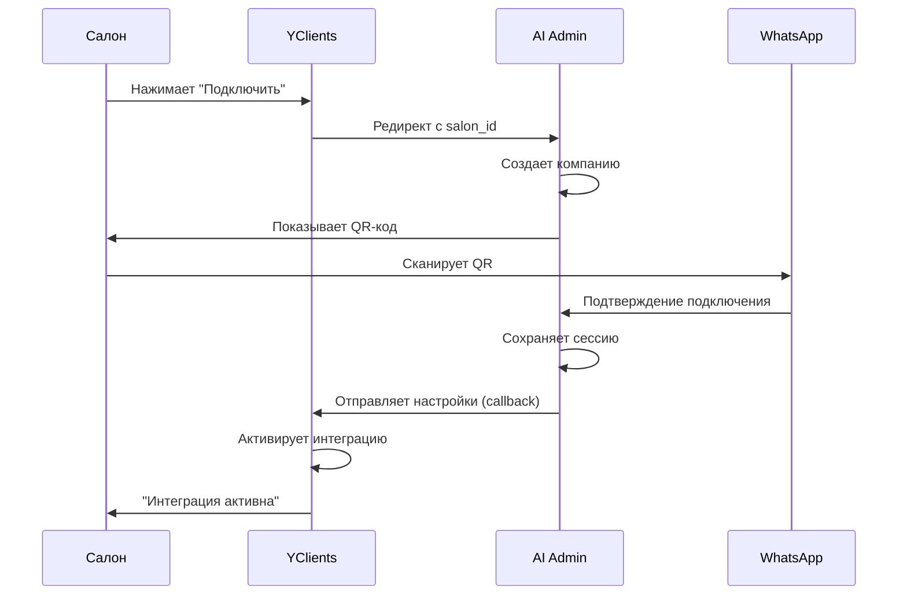

# Интеграция AI Admin через маркетплейс YClients

## 📋 Обзор процесса

### Что видит клиент (владелец салона):

1. **В YClients маркетплейсе:**
   - Находит "AI Admin - WhatsApp бот для салона"
   - Нажимает "Подключить"
   - Переходит на нашу страницу

2. **На нашей странице (5 секунд):**
   - Видит QR-код для WhatsApp
   - Сканирует телефоном
   - Видит "✅ Подключено!"

3. **Возврат в YClients:**
   - Автоматический редирект
   - Видит "Интеграция активна"
   - Бот готов к работе!

## 🔧 Техническая реализация

### 1. Endpoint для приема из маркетплейса

```javascript
// src/api/routes/marketplace.js

const express = require('express');
const router = express.Router();

// Страница регистрации из маркетплейса
router.get('/marketplace/register', async (req, res) => {
  const { salon_id } = req.query;
  
  if (!salon_id) {
    return res.status(400).send('Отсутствует salon_id');
  }
  
  try {
    // Получаем данные салона из YClients
    const salonData = await yclientsAPI.getSalonInfo(salon_id);
    
    // Создаем или находим компанию в нашей БД
    let company = await Company.findOne({ yclients_salon_id: salon_id });
    
    if (!company) {
      company = await Company.create({
        yclients_salon_id: salon_id,
        name: salonData.title,
        phone: salonData.phone,
        email: salonData.email,
        address: salonData.address,
        api_key: generateAPIKey()
      });
    }
    
    // Генерируем токен для WhatsApp подключения
    const whatsappToken = jwt.sign(
      { company_id: company.id, salon_id },
      process.env.JWT_SECRET,
      { expiresIn: '24h' }
    );
    
    // Сохраняем токен в Redis для отслеживания
    await redis.set(`whatsapp_token:${whatsappToken}`, company.id, 'EX', 86400);
    
    // Показываем страницу с QR-кодом
    res.render('marketplace-connect', {
      company,
      salon_id,
      whatsapp_token: whatsappToken,
      application_id: process.env.YCLIENTS_APPLICATION_ID
    });
    
  } catch (error) {
    console.error('Ошибка регистрации из маркетплейса:', error);
    res.status(500).send('Ошибка регистрации. Попробуйте позже.');
  }
});
```

### 2. Страница с QR-кодом

```html
<!-- views/marketplace-connect.ejs -->
<!DOCTYPE html>
<html lang="ru">
<head>
  <meta charset="UTF-8">
  <title>Подключение AI Admin</title>
  <style>
    body {
      font-family: -apple-system, BlinkMacSystemFont, 'Segoe UI', Roboto, sans-serif;
      margin: 0;
      padding: 0;
      min-height: 100vh;
      background: linear-gradient(135deg, #667eea 0%, #764ba2 100%);
      display: flex;
      justify-content: center;
      align-items: center;
    }
    
    .container {
      background: white;
      border-radius: 20px;
      padding: 40px;
      box-shadow: 0 20px 60px rgba(0,0,0,0.15);
      max-width: 500px;
      width: 90%;
    }
    
    .logo {
      text-align: center;
      margin-bottom: 30px;
    }
    
    .logo h1 {
      color: #333;
      font-size: 28px;
      margin: 0;
    }
    
    .company-info {
      background: #f8f9fa;
      border-radius: 10px;
      padding: 15px;
      margin-bottom: 30px;
    }
    
    .company-info h2 {
      margin: 0 0 10px 0;
      font-size: 20px;
      color: #333;
    }
    
    .qr-section {
      text-align: center;
    }
    
    .qr-container {
      background: white;
      border: 2px solid #e1e8ed;
      border-radius: 15px;
      padding: 20px;
      margin: 20px auto;
      display: inline-block;
    }
    
    #qr-image {
      width: 280px;
      height: 280px;
    }
    
    .status {
      margin-top: 20px;
      padding: 15px;
      border-radius: 10px;
      text-align: center;
      font-weight: 500;
    }
    
    .status.waiting {
      background: #fef3c7;
      color: #92400e;
    }
    
    .status.connected {
      background: #d1fae5;
      color: #065f46;
    }
    
    .instructions {
      background: #f0f4f8;
      border-radius: 10px;
      padding: 20px;
      margin-top: 20px;
    }
    
    .instructions h3 {
      margin-top: 0;
      color: #333;
    }
    
    .instructions ol {
      margin: 10px 0;
      padding-left: 20px;
    }
    
    .instructions li {
      margin: 8px 0;
      color: #555;
    }
    
    .timer {
      text-align: center;
      color: #6b7280;
      margin-top: 15px;
      font-size: 14px;
    }
    
    .success-animation {
      animation: fadeIn 0.5s ease-in;
    }
    
    @keyframes fadeIn {
      from { opacity: 0; transform: scale(0.9); }
      to { opacity: 1; transform: scale(1); }
    }
    
    .spinner {
      border: 3px solid #f3f3f3;
      border-top: 3px solid #667eea;
      border-radius: 50%;
      width: 40px;
      height: 40px;
      animation: spin 1s linear infinite;
      margin: 20px auto;
    }
    
    @keyframes spin {
      0% { transform: rotate(0deg); }
      100% { transform: rotate(360deg); }
    }
  </style>
</head>
<body>
  <div class="container">
    <div class="logo">
      <h1>🤖 AI Admin</h1>
      <p>WhatsApp бот для вашего салона</p>
    </div>
    
    <div class="company-info">
      <h2><%= company.name %></h2>
      <p>📱 <%= company.phone %></p>
      <p>📧 <%= company.email %></p>
    </div>
    
    <div class="qr-section" id="qr-section">
      <h3>Подключите WhatsApp</h3>
      
      <div class="qr-container">
        <canvas id="qr-canvas"></canvas>
      </div>
      
      <div class="status waiting" id="status">
        ⏳ Ожидание сканирования...
      </div>
      
      <div class="timer" id="timer">
        QR-код обновится через: <span id="countdown">20</span> сек
      </div>
    </div>
    
    <div class="instructions">
      <h3>📱 Как подключить:</h3>
      <ol>
        <li>Откройте <strong>WhatsApp</strong> на телефоне</li>
        <li>Перейдите в <strong>Настройки → Связанные устройства</strong></li>
        <li>Нажмите <strong>Привязать устройство</strong></li>
        <li>Отсканируйте QR-код выше</li>
      </ol>
    </div>
  </div>
  
  <!-- Форма для редиректа после успешного подключения -->
  <form id="callback-form" method="POST" action="https://api.yclients.com/marketplace/partner/callback/redirect" style="display: none;">
    <input type="hidden" name="salon_id" value="<%= salon_id %>">
    <input type="hidden" name="application_id" value="<%= application_id %>">
    <input type="hidden" name="api_key" id="api_key">
    <input type="hidden" name="webhook_urls[]" id="webhook_url">
  </form>
  
  <script src="/socket.io/socket.io.js"></script>
  <script src="https://cdn.jsdelivr.net/npm/qrcode/build/qrcode.min.js"></script>
  <script>
    const token = '<%= whatsapp_token %>';
    const companyId = '<%= company.id %>';
    const salonId = '<%= salon_id %>';
    
    let socket;
    let qrUpdateInterval;
    let countdownInterval;
    let countdown = 20;
    
    // Генерация QR-кода
    async function generateQR() {
      try {
        const response = await fetch(`/api/whatsapp/qr/${token}`);
        const data = await response.json();
        
        if (data.qr) {
          // Отображаем QR-код на canvas
          const canvas = document.getElementById('qr-canvas');
          QRCode.toCanvas(canvas, data.qr, {
            width: 280,
            margin: 1,
            color: {
              dark: '#000000',
              light: '#FFFFFF'
            }
          });
          
          // Сбрасываем таймер
          countdown = 20;
        }
      } catch (error) {
        console.error('Ошибка получения QR-кода:', error);
      }
    }
    
    // Обновление таймера
    function updateTimer() {
      countdown--;
      document.getElementById('countdown').textContent = countdown;
      
      if (countdown <= 0) {
        generateQR();
        countdown = 20;
      }
    }
    
    // Инициализация WebSocket
    function initWebSocket() {
      socket = io('/marketplace', {
        query: { token, companyId }
      });
      
      // Слушаем обновления QR-кода
      socket.on('qr-update', (data) => {
        generateQR();
      });
      
      // Слушаем успешное подключение
      socket.on('whatsapp-connected', async (data) => {
        clearInterval(qrUpdateInterval);
        clearInterval(countdownInterval);
        
        // Показываем успех
        document.getElementById('qr-section').innerHTML = `
          <div class="success-animation">
            <div style="font-size: 72px; margin: 20px 0;">✅</div>
            <h2 style="color: #059669;">WhatsApp подключен!</h2>
            <p>Номер: ${data.phone}</p>
            <div class="spinner"></div>
            <p>Завершение настройки...</p>
          </div>
        `;
        
        // Заполняем форму для редиректа
        document.getElementById('api_key').value = data.api_key;
        document.getElementById('webhook_url').value = data.webhook_url;
        
        // Отправляем форму через 2 секунды
        setTimeout(() => {
          document.getElementById('callback-form').submit();
        }, 2000);
      });
      
      // Обработка ошибок
      socket.on('error', (error) => {
        document.getElementById('status').className = 'status error';
        document.getElementById('status').innerHTML = `❌ Ошибка: ${error.message}`;
      });
    }
    
    // Запуск при загрузке страницы
    document.addEventListener('DOMContentLoaded', () => {
      // Генерируем первый QR
      generateQR();
      
      // Запускаем таймер обновления
      countdownInterval = setInterval(updateTimer, 1000);
      
      // Подключаем WebSocket
      initWebSocket();
    });
  </script>
</body>
</html>
```

### 3. Backend для QR-кода и WebSocket

```javascript
// src/api/routes/whatsapp-qr.js

const baileys = require('../../integrations/whatsapp/baileys-provider');

// Генерация QR для конкретной компании
router.get('/api/whatsapp/qr/:token', async (req, res) => {
  try {
    const { token } = req.params;
    
    // Проверяем токен
    const companyId = await redis.get(`whatsapp_token:${token}`);
    if (!companyId) {
      return res.status(401).json({ error: 'Invalid or expired token' });
    }
    
    // Генерируем QR через Baileys
    const qr = await baileys.generateQRForCompany(companyId);
    
    res.json({
      qr: qr,
      expires_in: 20
    });
    
  } catch (error) {
    console.error('QR generation error:', error);
    res.status(500).json({ error: 'Failed to generate QR' });
  }
});

// WebSocket для real-time обновлений
io.of('/marketplace').on('connection', (socket) => {
  const { token, companyId } = socket.handshake.query;
  
  console.log(`Marketplace client connected: ${companyId}`);
  
  // Подписываемся на события Baileys для этой компании
  baileys.on(`qr-${companyId}`, (qr) => {
    socket.emit('qr-update', { qr });
  });
  
  baileys.on(`connected-${companyId}`, async (data) => {
    // Получаем данные компании
    const company = await Company.findById(companyId);
    
    // Отправляем успех клиенту
    socket.emit('whatsapp-connected', {
      phone: data.phone,
      api_key: company.api_key,
      webhook_url: `https://api.ai-admin.ru/webhook/yclients/${company.id}`
    });
  });
  
  socket.on('disconnect', () => {
    console.log(`Marketplace client disconnected: ${companyId}`);
  });
});
```

### 4. Интеграция с Baileys

```javascript
// src/integrations/whatsapp/marketplace-baileys.js

class MarketplaceBaileys {
  constructor() {
    this.sessions = new Map();
  }
  
  async generateQRForCompany(companyId) {
    // Создаем новую сессию для компании
    const { state, saveCreds } = await useMultiFileAuthState(
      `./sessions/company_${companyId}`
    );
    
    const sock = makeWASocket({
      auth: state,
      printQRInTerminal: false
    });
    
    // Сохраняем сессию
    this.sessions.set(companyId, { sock, saveCreds });
    
    // Слушаем события
    sock.ev.on('creds.update', saveCreds);
    
    sock.ev.on('connection.update', (update) => {
      const { connection, lastDisconnect, qr } = update;
      
      if (qr) {
        // Отправляем новый QR
        this.emit(`qr-${companyId}`, qr);
        return qr;
      }
      
      if (connection === 'open') {
        // WhatsApp подключен!
        this.emit(`connected-${companyId}`, {
          phone: sock.user.id.split('@')[0]
        });
        
        // Сохраняем в БД
        this.saveConnection(companyId, sock.user);
      }
    });
    
    // Ждем первый QR
    return new Promise((resolve) => {
      sock.ev.once('connection.update', (update) => {
        if (update.qr) {
          resolve(update.qr);
        }
      });
    });
  }
  
  async saveConnection(companyId, user) {
    await Company.update(
      { 
        whatsapp_connected: true,
        whatsapp_phone: user.id.split('@')[0],
        whatsapp_name: user.name
      },
      { where: { id: companyId } }
    );
  }
}
```

## 📊 Диаграмма процесса



## ✅ Чеклист для запуска

- [ ] Получить application_id от YClients
- [ ] Зарегистрировать домен в маркетплейсе
- [ ] Настроить SSL сертификат
- [ ] Реализовать endpoints:
  - [ ] `/marketplace/register`
  - [ ] `/api/whatsapp/qr/:token`
  - [ ] WebSocket для real-time
- [ ] Создать красивую страницу подключения
- [ ] Настроить Baileys для multi-tenant
- [ ] Протестировать полный flow
- [ ] Подготовить видео-инструкцию

## 🎯 Результат для салона

1. **Быстро**: 5 секунд на подключение
2. **Просто**: Только QR-код, никаких настроек
3. **Надежно**: Автоматическое переподключение
4. **Удобно**: Все в интерфейсе YClients