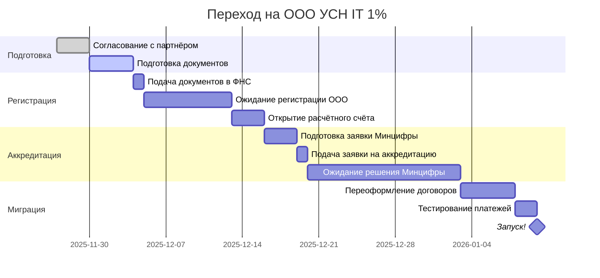

# ИП vs ООО: Быстрая шпаргалка для Admin AI

**Обновлено:** 27 ноября 2025

---

## 🎯 Вердикт: **ООО на УСН IT 1%** (Московская область)

**Причина:** 2 учредителя + SaaS + льготы МО = оптимальная схема

---

## 📊 Сравнение в цифрах (пилот 30 салонов, 5.4M₽/год)

```
┌─────────────────┬──────────────┬──────────────┬──────────────┬──────────────┐
│     Режим       │  Налоги/год  │  На руки/год │  Учредители  │   Статус     │
├─────────────────┼──────────────┼──────────────┼──────────────┼──────────────┤
│ ИП УСН 6%       │   373,284₽   │  5,023,116₽  │      1       │ ❌ Не подходит│
│ ИП Патент       │       ❌      │       ❌      │      1       │ ❌ Лимит 60M │
│ ООО УСН 6%      │   980,724₽   │  4,415,676₽  │      2       │ ⚠️ Дорого    │
│ ООО УСН IT 1% ⭐│   748,480₽   │  4,647,920₽  │      2       │ ✅ ЛУЧШИЙ    │
└─────────────────┴──────────────┴──────────────┴──────────────┴──────────────┘

💰 Экономия ООО IT 1% vs ООО УСН 6%: +232,244₽/год (+19,354₽/мес)
```

---

## ⚡ Ключевые преимущества ООО УСН IT 1%

| Параметр | Значение | Выгода |
|----------|----------|--------|
| **Налог УСН** | 1% вместо 6% | 📉 Экономия 83% |
| **Страховые взносы** | 7.6% вместо 30% | 📉 Экономия 74.7% |
| **Учредители** | 2+ (гибкие доли) | 🤝 Официальное партнёрство |
| **Ответственность** | В пределах уставного капитала | 🛡️ Личное имущество защищено |
| **Льготные кредиты** | 1-3% годовых | 💳 Дешёвое финансирование |
| **Репутация** | IT-компания с аккредитацией | 🏆 B2B-доверие |

---

## ✅ Admin AI соответствует критериям аккредитации

| Критерий | Требование | Admin AI | Статус |
|----------|-----------|----------|--------|
| **Форма** | ООО/АО | ООО | ✅ |
| **ОКВЭД** | 62.01 или 63.1 | 62.01 | ✅ |
| **Доля IT** | ≥30% (для аккредитации) | 100% | ✅ |
| **Доля IT** | ≥70% (для льгот) | 100% | ✅ |
| **Зарплата** | ≥средней по РФ | Стартап <3 лет = освобождение | ✅ |
| **SaaS** | Подходит? | Да (явно указано в критериях) | ✅ |
| **Долги** | <3,000₽ | 0₽ | ✅ |

**Результат:** 🎯 **Все критерии выполнены!**

---

## 🚀 План действий (6 недель)



### Недели 1-2: Подготовка
- [x] Прочитать исследование `IP_vs_OOO_Research_2024-2025.md`
- [ ] Обсудить с партнёром доли (рекомендую 60/40 или 51/49)
- [ ] Подготовить устав ООО (шаблон)
- [ ] Получить ЭЦП (для бесплатной регистрации)

### Недели 3-4: Регистрация ООО
- [ ] Подать документы через Госуслуги (бесплатно)
- [ ] Дождаться ОГРН (8-9 дней)
- [ ] Открыть расчётный счёт (Тинькофф/Сбер)
- [ ] Подать уведомление о переходе на УСН

### Недели 5-6: Аккредитация IT
- [ ] Подать заявку на аккредитацию (Госуслуги)
- [ ] Дождаться решения Минцифры (14 дней)
- [ ] Уведомить ФНС о праве на УСН IT 1%
- [ ] Переоформить договоры на ООО

---

## 💰 Вывод прибыли: оптимальная схема

### Рекомендация: **Только дивиденды** (на старте)

**Почему:**
- ✅ НДФЛ 13% (vs 13% + взносы 7.6% на зарплату)
- ✅ Без страховых взносов
- ✅ Простая схема
- ✅ Минимум вопросов от ФНС

**Пример для пилота (30 салонов, доли 60/40):**

```
Годовой доход:     5,396,400₽
УСН IT 1%:           -53,964₽
─────────────────────────────
Прибыль до НДФЛ:  5,342,436₽
НДФЛ 13%:           -694,516₽
─────────────────────────────
Чистая прибыль:   4,647,920₽

Учредитель 1 (60%):  2,788,752₽/год  (232,396₽/мес)
Учредитель 2 (40%):  1,859,168₽/год  (154,931₽/мес)
```

**Периодичность:** Ежеквартально (указать в уставе)

---

## ⚠️ Топ-5 рисков и как их избежать

| # | Риск | Митигация |
|---|------|-----------|
| 1 | **Потеря аккредитации** (доля IT <70%) | 📊 Контроль выручки ежеквартально |
| 2 | **НДС при росте >60M/год** | 📈 Планировать заранее (это ~250 салонов) |
| 3 | **Дедлок при равных долях 50/50** | 🤝 Доли 60/40 или 51/49 (один контролирует) |
| 4 | **Изменения законодательства** | 📰 Следить за новостями IT-льгот |
| 5 | **Забыли подтвердить аккредитацию** | 📅 Календарь: каждый год до 1 июня |

---

## 📅 Ежегодный календарь ООО IT

| Дата | Событие | Действие |
|------|---------|----------|
| **До 1 июня** | 🔄 Подтверждение аккредитации | Заполнить форму на Госуслугах |
| **До 31 марта** | 📄 Декларация УСН | Отправить в ФНС (бухгалтер) |
| **Ежеквартально** | 💰 Дивиденды | Собрание учредителей + выплата |
| **Ежеквартально** | 📊 Контроль доли IT | Проверить ≥70% |
| **31 декабря** | 📋 КУДиР | Книга учёта доходов/расходов |

---

## 🆚 Почему НЕ другие варианты?

### ❌ ИП УСН 6%
- **Проблема:** Нельзя оформить на 2 учредителей (ИП = 1 физлицо)
- **Когда подходит:** Для solo-founder'ов

### ❌ ИП Патент
- **Проблема:** Лимит 60M₽/год (Admin AI превысит в пилоте)
- **Когда подходит:** Для фрилансеров с доходом <5M₽/год

### ⚠️ ООО УСН 6% (стандарт)
- **Проблема:** Дороже на 232K₽/год vs ООО IT 1%
- **Когда подходит:** Если не получили IT-аккредитацию

---

## 📞 Контакты и ресурсы

### Официальные источники
- **Аккредитация IT:** https://gosuslugi.ru → "Аккредитация IT-компаний"
- **Реестр IT-компаний:** https://digital.gov.ru/ru/activity/statistic/rating/
- **Закон МО об УСН IT 1%:** Закон № 9/2009-ОЗ от 12.02.2009, ст. 2.4

### Полезные сервисы
- **Регистрация ООО:** Госуслуги (бесплатно с ЭЦП)
- **Бухгалтерия:** Контур, Моё дело, Тинькофф
- **Калькулятор УСН:** https://www.regberry.ru/calculators/usn

### Документы проекта
- **Полное исследование:** `docs/business/IP_vs_OOO_Research_2024-2025.md` (56KB, 1004 строки)
- **Финмодель Admin AI:** (уточнить путь к файлу)

---

## 🎯 Чек-лист "Готовы ли вы к ООО IT?"

- [ ] У вас 2+ учредителя (ИП не подходит)
- [ ] SaaS/IT-деятельность = ≥70% доходов
- [ ] Готовы получить аккредитацию Минцифры
- [ ] Готовы подтверждать аккредитацию ежегодно
- [ ] Понимаете, что "на руки" будет меньше чем в ИП (из-за НДФЛ на дивиденды)
- [ ] Готовы к более сложной отчётности (нужен бухгалтер)
- [ ] Планируете рост >60M₽/год (иначе патент выгоднее)

**Если ≥5 галочек:** ООО УСН IT 1% — ваш выбор! ✅

---

## 💡 Совет от исследования

> "ИП налогово выгоднее на малых оборотах, но для Admin AI с 2 учредителями это технически невозможно. ООО УСН IT 1% — единственный легальный вариант с максимальными льготами."

**Старт:** Декабрь 2025
**Цель:** Аккредитация до конца января 2026
**Экономия:** ~232K₽/год уже на пилоте

---

**Готовы начать?** Читайте полное исследование в `IP_vs_OOO_Research_2024-2025.md` 📖
