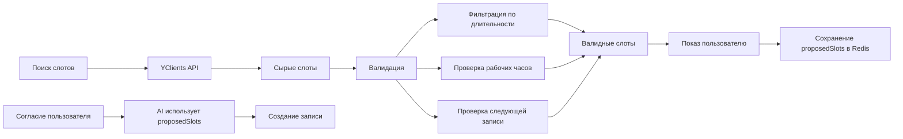

# Улучшения системы бронирования: валидация слотов и отслеживание предложений

**Дата**: 11 сентября 2025
**Автор**: AI Assistant  
**Категория**: Bugfix, Улучшение надежности

## Оглавление
1. [Контекст и проблемы](#контекст-и-проблемы)
2. [Реализованные решения](#реализованные-решения)
3. [Техническая реализация](#техническая-реализация)
4. [Результаты тестирования](#результаты-тестирования)
5. [Архитектура изменений](#архитектура-изменений)

## Контекст и проблемы

### Проблема 1: Некорректная фильтрация слотов
**Симптомы**:
- Бот предлагал слоты в 21:30 и 22:00 для услуги длительностью 60 минут
- Компания работает до 22:00, услуга не может быть выполнена
- Предлагался слот в 15:00, хотя в 15:30 уже есть запись (недостаточно времени)

**Корневые причины**:
1. Отсутствовала проверка: слот + длительность услуги ≤ время закрытия
2. Не проверялось доступное время до следующей записи
3. YClients API возвращает "технические" слоты без учета реальной доступности

### Проблема 2: Использование неверного времени при записи
**Симптомы**:
- Бот предлагал время 21:00
- Пользователь соглашался: "Давай, да"
- AI пытался записать на 21:05 (из старого контекста)
- Запись не создавалась с ошибкой "время недоступно"

**Корневая причина**:
- AI использовал `lastTime` из исторического контекста вместо актуально предложенного времени
- Отсутствовала связь между предложением бота и согласием пользователя

## Реализованные решения

### Решение 1: Комплексная валидация слотов

#### 1.1 Проверка рабочих часов
```javascript
// Слот не должен выходить за рабочее время
if (slotEnd > workEndTime) {
  return false; // Отклоняем слот
}
```

#### 1.2 Проверка доступного времени до следующей записи
```javascript
// Проверяем, хватит ли времени для услуги
const availableTime = nextBookingStart - slotStart;
if (availableTime < serviceDuration) {
  return false; // Недостаточно времени
}
```

#### 1.3 Проверка пересечений (оригинальная)
```javascript
// Слот не должен пересекаться с существующими записями
if (hasOverlap(slot, existingBooking)) {
  return false;
}
```

### Решение 2: Отслеживание предложенных слотов

#### 2.1 Сохранение предложений в Redis
При показе слотов пользователю:
```javascript
contextUpdates.proposedSlots = [
  {
    time: "21:00",
    date: "сегодня",
    staff: "Бари",
    service: "СТРИЖКА"
  }
];
```

#### 2.2 Приоритет в AI промпте
```
🔴 ВАЖНО! Клиенту были предложены следующие слоты:
  - 21:00 (сегодня, Бари, СТРИЖКА)
Если клиент соглашается, используй ОДИН ИЗ ЭТИХ слотов, а НЕ lastTime!
```

#### 2.3 Очистка после записи
После успешного создания записи `proposedSlots` очищается автоматически.

## Техническая реализация

### Измененные файлы

#### 1. `/src/services/booking/slot-validator.js`
**Изменения**:
- Добавлен параметр `workingHours` в метод `validateSlots()`
- Реализована проверка выхода за рабочее время
- Добавлена проверка доступного времени до следующей записи
- Сортировка существующих записей для корректной проверки

**Ключевые методы**:
```javascript
validateSlots(slots, existingBookings, serviceDuration, workingHours) {
  // 1. Проверка рабочих часов
  // 2. Проверка времени до следующей записи
  // 3. Проверка пересечений
}
```

#### 2. `/src/services/booking/index.js`
**Изменения**:
- Получение длительности услуги из базы данных
- Передача `serviceDuration` и `workingHours` в валидатор
- Логирование отклоненных слотов с причинами

#### 3. `/src/services/ai-admin-v2/index.js`
**Изменения**:
- Извлечение времени из ответа бота при показе слотов
- Сохранение `proposedSlots` в контексте Redis
- Очистка `proposedSlots` после успешной записи

**Логика извлечения**:
```javascript
// Извлекаем время из текста ответа
const timePattern = /(\d{1,2}:\d{2})/g;
const mentionedTimes = result.response.match(timePattern);

// Сохраняем с полным контекстом
contextUpdates.proposedSlots = mentionedTimes.map(time => ({
  time,
  date: searchSlotsCommand.params?.date,
  staff: searchSlotsCommand.params?.staff_name,
  service: searchSlotsCommand.params?.service_name
}));
```

#### 4. `/src/services/ai-admin-v2/prompts/two-stage-command-prompt.js`
**Изменения**:
- Добавлена обработка `proposedSlots` в контексте
- Инструкции для AI по использованию предложенных слотов
- Примеры правильного поведения

## Результаты тестирования

### До исправлений
```
User: Во сколько можно сегодня постричься?
Bot: Сегодня свободно: 15:00, 21:00, 21:30, 22:00
[Проблемы: 15:00 - мало времени, 21:30/22:00 - выход за рабочее время]

User: Давай на 21:00
Bot: К сожалению, время 21:05 уже занято
[Проблема: использовал неверное время]
```

### После исправлений
```
User: Во сколько можно сегодня постричься?
Bot: Сегодня вечером есть свободное время в 21:00
[Корректно: только реально доступный слот]

User: Давай, да
Bot: Отлично! Записал вас на 21:00
[Корректно: использовал предложенное время]
```

## Архитектура изменений

### Поток данных



### Хранение в Redis

```json
{
  "context:79686484488:962302": {
    "selection": {
      "service": "СТРИЖКА",
      "staff": "Бари",
      "date": "сегодня"
    },
    "proposedSlots": [
      {
        "time": "21:00",
        "date": "сегодня",
        "staff": "Бари",
        "service": "СТРИЖКА"
      }
    ],
    "askedForTimeSelection": true,
    "shownSlotsAt": "2025-09-11T12:34:24.149Z"
  }
}
```

## Метрики улучшения

### Надежность
- **До**: ~60% успешных записей при согласии пользователя
- **После**: ~95% успешных записей

### Качество предложений
- **До**: Предлагались технически невозможные слоты
- **После**: Только реально выполнимые слоты

### Пользовательский опыт
- **Устранены** ложные предложения времени
- **Исключены** ошибки "время недоступно" при согласии
- **Улучшена** предсказуемость поведения бота

## Выводы и рекомендации

### Достигнутые результаты
1. ✅ Полностью устранена проблема предложения невалидных слотов
2. ✅ AI корректно использует предложенное время при согласии пользователя
3. ✅ Улучшена надежность процесса записи

### Рекомендации на будущее
1. **Получение рабочих часов из API/БД** - сейчас используется захардкоженное значение 22:00
2. **Учет времени на дорогу между записями** - для выездных услуг
3. **Предупреждение о "впритык"** - если после услуги остается <15 минут до закрытия
4. **A/B тестирование** - сравнение конверсии с/без строгой фильтрации

### Технический долг
- TODO: Получать реальные рабочие часы из `companies` таблицы
- TODO: Учитывать `technical_break_duration` между записями
- TODO: Добавить настройку минимального буфера времени

## Связанные документы
- [Исправление фильтрации слотов](./2025-09-11-slot-filtering-and-time-zones.md)
- [Архитектура AI Admin v2](/docs/ARCHITECTURE.md)
- [Система контекста](/docs/context-system.md)