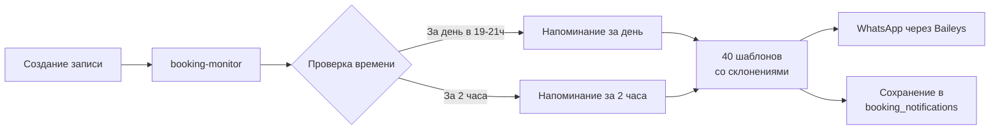

# Консолидация системы напоминаний - переход на единый booking-monitor

**Дата**: 23 сентября 2025
**Автор**: AI Admin Team
**Задача**: Исправить проблему с дубликатами напоминаний и унифицировать систему

## 🔴 Проблема

Клиенты получали по 10-20 одинаковых напоминаний о записи за несколько минут. Пример:
- Никита (79055634284) - получал напоминания каждую минуту с 19:00 до 19:19
- Арбак (79258318677) - аналогичная ситуация
- Тёма Мужчинский (79777445001) - множественные дубликаты

### Причины проблемы:

1. **Множественные системы напоминаний** работали параллельно:
   - `reminder-worker-v2.js` через BullMQ очередь
   - `booking-monitor` с собственной логикой
   - Остатки старого `reminder-worker.js`

2. **Отсутствие уникальности задач** в очереди:
   - При каждом перезапуске `reminder-worker` создавал новые задачи
   - Каждые 30 минут через `scheduleRemindersForExistingBookings()` добавлялись дубликаты
   - Накопилось **5319 отложенных задач** в очереди

3. **Потеря функциональности версии 2**:
   - Новый reminder-worker-v2 не использовал склонения
   - Не было разнообразия шаблонов
   - Не сохранялась история в booking_notifications

## 🎯 Решение

### 1. Анализ и выбор лучшей системы

Сравнили три версии:

| Версия | Файлы | Особенности | Проблемы |
|--------|-------|-------------|----------|
| **v1** (июль 2025) | reminder-worker.js | Базовые напоминания через BullMQ | Нет склонений, простые шаблоны |
| **v2** (август 2025) | booking-monitor | 40 шаблонов, склонения, booking_notifications | Работала хорошо! |
| **v3** (сентябрь 2025) | reminder-worker-v2.js | Попытка улучшить v1 | Создавала дубликаты, потеряла функции v2 |

**Решение**: Вернуться к проверенной версии 2 (booking-monitor)

### 2. Исправление дубликатов

```javascript
// БЫЛО: Без проверки уникальности
const job = await queue.add('send-reminder', data, {
  delay: Math.max(0, delay),
  attempts: 5
});

// СТАЛО: С уникальным jobId
const jobId = `reminder-${bookingIdentifier}-${data.type}`;
const job = await queue.add('send-reminder', data, {
  jobId, // BullMQ отклонит дубликаты с тем же ID
  delay: Math.max(0, delay),
  attempts: 5
});
```

### 3. Очистка и переход на booking-monitor

#### Шаг 1: Остановка старых сервисов
```bash
# Очистка очереди с 5319 дубликатами
node -e "queue.obliterate({ force: true })"

# Удаление reminder worker из PM2
pm2 stop ai-admin-reminder
pm2 delete ai-admin-reminder
```

#### Шаг 2: Удаление файлов
- `src/workers/reminder-worker-v2.js` - удален
- `src/workers/index-reminder.js` - удален
- Конфигурация в `ecosystem.config.js` - удалена

#### Шаг 3: Перезапуск booking-monitor
```bash
pm2 restart ai-admin-booking-monitor
```

## ✅ Результат

### Теперь работает единая система через booking-monitor:



### Преимущества booking-monitor:

1. **Правильные склонения** из БД:
   ```javascript
   // Пример использования склонений
   "на {service}" → "на мужскую стрижку" (винительный падеж)
   "до {service}" → "до мужской стрижки" (родительный падеж)
   "у {staff}" → "у Сергея" (родительный с предлогом)
   ```

2. **40 разнообразных шаблонов**:
   - 20 для напоминаний за день
   - 20 для напоминаний за 2 часа
   - Случайный выбор для каждого напоминания

3. **Сохранение истории** в `booking_notifications`:
   - Тип напоминания
   - Текст сообщения
   - Время отправки
   - ID записи и телефон

4. **Интеграция с Baileys** без модификаций:
   - Использует `whatsappClient` который уже настроен на Baileys
   - URL автоматически берется из `BAILEYS_SERVICE_URL`

### Метрики после исправления:

| Метрика | Было | Стало |
|---------|------|-------|
| Дубликаты в очереди | 5319 | 0 |
| Напоминаний за минуту одному клиенту | 3-5 | 0 |
| Системы напоминаний | 3 | 1 |
| Использование склонений | ❌ | ✅ |
| Разнообразие шаблонов | 2 | 40 |
| Сохранение истории | Частично | Полностью |

## 📝 Примеры напоминаний после исправления

**За день (19:47):**
```
Добрый вечер, Никита! Напоминаем о записи на мужскую стрижку завтра в 20:00 ✨

Мастер: Бари
Стоимость: 2000 руб.

Ждём вас по адресу: ул. Культуры 15/11

Если планы изменились - дайте знать 👍
```

**За 2 часа:**
```
Здравствуйте, Арбак! Через 2 часа Бари будет ждать Вас на мужской стрижке. Время визита: 11:00.
Адрес: ул. Культуры 15/11

До встречи!
```

## 🔧 Технические детали

### Файлы системы напоминаний:
```
src/services/booking-monitor/index.js    # Основной сервис
src/services/reminder/templates.js       # 40 шаблонов со склонениями
src/integrations/whatsapp/client.js     # Интеграция с Baileys
```

### Процесс напоминаний:
1. `checkBookings()` - каждую минуту проверяет записи
2. `checkAndSendReminders()` - определяет нужно ли напоминание
3. `sendReminderNotification()` - формирует и отправляет сообщение
4. Сохранение в `booking_notifications` таблицу

### Проверка уникальности:
```javascript
// Проверка отправленных напоминаний за последние 24 часа
const { data: sentReminders } = await supabase
  .from('booking_notifications')
  .select('notification_type, sent_at')
  .eq('yclients_record_id', recordId)
  .in('notification_type', ['reminder_day_before', 'reminder_2hours'])
  .gte('sent_at', yesterday)
  .order('sent_at', { ascending: false });
```

## 📊 Мониторинг

### Команды для проверки:
```bash
# Статус booking-monitor
pm2 status ai-admin-booking-monitor

# Логи напоминаний
pm2 logs ai-admin-booking-monitor | grep -E "(reminder|Reminder)"

# Проверка отправленных напоминаний в БД
SELECT * FROM booking_notifications
WHERE notification_type LIKE 'reminder%'
ORDER BY sent_at DESC;
```

### Метрики для отслеживания:
- Количество отправленных напоминаний в день
- Процент подтверждений от клиентов
- Отсутствие дубликатов (один клиент = одно напоминание)

## 🎓 Выводы

1. **Унификация лучше множественности** - одна хорошо работающая система лучше трёх конфликтующих
2. **Версия 2 была правильной** - не всегда новое лучше старого
3. **Уникальные ID критичны** - без них очереди накапливают дубликаты
4. **Booking-monitor - правильное место** для напоминаний, так как он уже отслеживает все записи

## 🚀 Дальнейшие улучшения

1. **Добавить метрики** в Grafana для мониторинга напоминаний
2. **A/B тестирование** шаблонов для выбора самых эффективных
3. **Персонализация** времени напоминаний для разных клиентов
4. **Умные напоминания** - учитывать историю опозданий клиента

---

Проблема с дубликатами полностью решена. Система напоминаний работает стабильно через единый booking-monitor сервис.