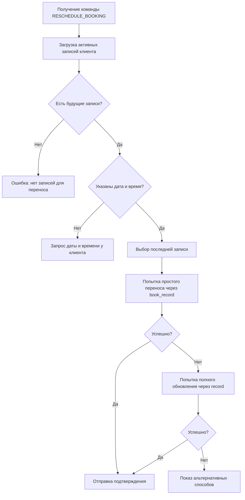

# Функция переноса записи (RESCHEDULE_BOOKING)

## Описание

Функция позволяет клиентам переносить свои записи на другое время через WhatsApp бота. Система автоматически находит активные записи клиента и предлагает перенести последнюю из них.

## Как работает

### Для пользователя:

1. Клиент пишет в WhatsApp о желании перенести запись
2. Бот запрашивает новые дату и время
3. После подтверждения запись переносится
4. Клиент получает подтверждение с новыми деталями

### Примеры фраз для активации:
- "Хочу перенести запись"
- "Можно изменить время записи?"
- "Перенесите мою запись на завтра"
- "Нужно перенести визит на другой день"

## Техническая реализация

### 1. Команда AI: RESCHEDULE_BOOKING

```
[RESCHEDULE_BOOKING date: завтра, time: 16:00]
```

### 2. Процесс обработки:



### 3. API методы YClients:

#### Простой перенос (основной метод):
```http
PUT /api/v1/book_record/{company_id}/{record_id}
{
  "datetime": "2025-07-29T16:00:00",
  "comment": "Перенос записи через WhatsApp бота"
}
```

#### Полное обновление (fallback):
```http
PUT /api/v1/record/{company_id}/{record_id}
{
  "datetime": "2025-07-29T16:00:00",
  "staff_id": 2895125,
  "services": [
    {
      "id": 18356010,
      "cost": 1000,
      "discount": 0
    }
  ],
  "client": {
    "phone": "79001234567",
    "name": "Николай",
    "email": ""
  },
  "comment": "Перенос записи через WhatsApp бота"
}
```

### 4. Обработка результатов:

#### Успешный перенос:
```javascript
{
  success: true,
  oldDateTime: "2025-07-28T15:00:00",
  newDateTime: "2025-07-29T16:00:00",
  services: [{id: 18356010, title: "МУЖСКАЯ СТРИЖКА"}],
  staff: {id: 2895125, name: "Сергей"}
}
```

#### Форматированный ответ клиенту:
```
✅ ✅ Запись успешно перенесена!

📋 Детали переноса:
❌ Старое время: пн, 28 июля 15:00
✅ Новое время: вт, 29 июля 16:00
💇 Услуга: МУЖСКАЯ СТРИЖКА
👤 Мастер: Сергей

💬 _Ждём вас в новое время! Если планы изменятся, пожалуйста, предупредите заранее._
```

## Ограничения

1. **Выбор записи**: Если у клиента несколько активных записей, система выберет последнюю
2. **Проверка доступности**: Система не проверяет доступность нового времени
3. **Уведомления**: Мастер не получает уведомление о переносе
4. **История**: Старое время записи не сохраняется в базе данных

## Альтернативные способы переноса

Если автоматический перенос не удался, клиенту предлагаются альтернативы:
- 📱 Мобильное приложение YClients
- 💻 Сайт yclients.com
- 📞 Звонок администратору

## Планы развития

1. **Выбор конкретной записи** при наличии нескольких
2. **Проверка доступности** нового времени перед переносом
3. **Уведомление мастера** о переносе
4. **Сохранение истории** переносов
5. **Ограничение количества** переносов для одной записи
6. **Запрет переноса** за определенное время до визита

## Конфигурация

Функция не требует дополнительной конфигурации и работает автоматически при наличии прав на изменение записей в YClients API.

## Мониторинг

Отслеживайте успешность переносов через логи:
```bash
# Поиск попыток переноса
grep "Attempting to reschedule booking" /opt/ai-admin/logs/worker-v2-out.log

# Успешные переносы
grep "Successfully rescheduled booking" /opt/ai-admin/logs/worker-v2-out.log

# Ошибки переноса
grep "Error rescheduling record" /opt/ai-admin/logs/worker-v2-error.log
```

## Тестирование

```javascript
// Тест команды переноса
const testReschedule = {
  phone: "79001234567",
  message: "Хочу перенести запись на завтра в 16:00"
};

// Ожидаемый результат:
// 1. Бот находит активную запись
// 2. Переносит на указанное время
// 3. Отправляет подтверждение с деталями
```