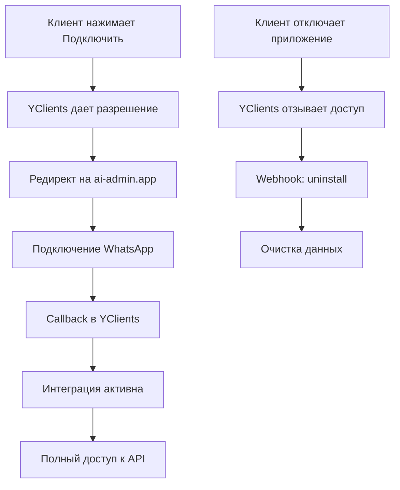

# 🔐 YClients Marketplace Authorization Flow

## ⚡ Ключевое открытие

**Приложения маркетплейса YClients НЕ требуют User Token!**

Когда салон подключает приложение через маркетплейс YClients:
- ✅ YClients автоматически дает разрешение от имени пользователя
- ✅ Partner Token + salon_id = полный доступ к API салона
- ✅ НЕ нужно запрашивать логин/пароль у клиента
- ✅ НЕ нужно получать User Token через /auth

## 🎯 Правильный Flow авторизации

### 1️⃣ Клиент нажимает "Подключить" в маркетплейсе

YClients делает редирект на наш сайт:
```
https://ai-admin.app/marketplace/register?salon_id=962302
```

### 2️⃣ Мы получаем данные салона

```javascript
// Используем ТОЛЬКО Partner Token!
const response = await fetch(`https://api.yclients.com/api/v1/company/${salon_id}`, {
  headers: {
    'Authorization': `Bearer ${PARTNER_TOKEN}`,
    'Accept': 'application/vnd.yclients.v2+json'
  }
});

// Получаем полную информацию о салоне
const company = await response.json();
```

### 3️⃣ После подключения WhatsApp отправляем callback

```javascript
// Активируем интеграцию через callback
await fetch('https://api.yclients.com/marketplace/partner/callback/redirect', {
  method: 'POST',
  headers: {
    'Authorization': `Bearer ${PARTNER_TOKEN}`,
    'Content-Type': 'application/json'
  },
  body: JSON.stringify({
    salon_id: 962302,
    application_id: OUR_APP_ID,  // ID приложения в маркетплейсе
    api_key: generateApiKey(),    // Наш внутренний ключ для салона
    webhook_urls: [
      'https://ai-admin.app/webhook/yclients/962302'
    ]
  })
});
```

### 4️⃣ После callback имеем полный доступ

```javascript
// Теперь можем работать со всеми API endpoints салона
const headers = {
  'Authorization': `Bearer ${PARTNER_TOKEN}`,
  'Accept': 'application/vnd.yclients.v2+json'
};

// ✅ Получать клиентов
GET https://api.yclients.com/api/v1/clients/${salon_id}

// ✅ Создавать записи
POST https://api.yclients.com/api/v1/records/${salon_id}

// ✅ Управлять расписанием
GET https://api.yclients.com/api/v1/schedule/${salon_id}

// ✅ Получать услуги и мастеров
GET https://api.yclients.com/api/v1/services/${salon_id}
GET https://api.yclients.com/api/v1/staff/${salon_id}
```

## 📊 Сравнение методов авторизации

| Метод | Когда используется | Что требуется | Доступ |
|-------|-------------------|---------------|---------|
| **Marketplace Flow** | Приложения из маркетплейса | Partner Token + salon_id | Полный доступ к салону |
| **Direct API** | Прямая интеграция | Partner Token + User Token | Ограничен правами пользователя |
| **Public API** | Виджеты записи | Только Partner Token | Только чтение публичных данных |

## ⚠️ Важные моменты

### ✅ Что МОЖНО делать с Partner Token после подключения через маркетплейс:
- Все операции с записями (создание, изменение, удаление)
- Работа с клиентами салона
- Управление расписанием
- Получение полной информации об услугах и ценах
- Создание и управление вебхуками
- Отправка уведомлений клиентам

### ❌ Что НЕ нужно делать:
- Запрашивать логин/пароль у клиента
- Использовать метод /auth для получения User Token
- Хранить учетные данные пользователей
- Беспокоиться о смене паролей (не влияет на доступ)

## 🔄 Жизненный цикл интеграции



## 🚀 Преимущества Marketplace подхода

1. **Простота для клиента** - один клик для подключения
2. **Безопасность** - не храним пароли
3. **Надежность** - доступ не зависит от смены пароля
4. **Автоматизация** - YClients сам управляет правами
5. **Соответствие** - работаем как Beauty Bot и другие топовые интеграции

## 📝 Чеклист для реализации

- [x] Понять, что User Token не нужен для маркетплейса
- [ ] Реализовать endpoint `/marketplace/register`
- [ ] Добавить обработку callback в YClients
- [ ] Настроить webhook endpoints
- [ ] Удалить все упоминания о запросе логина/пароля
- [ ] Обновить документацию для клиентов

## 🔗 Связанные документы

- [MARKETPLACE_INTEGRATION.md](./MARKETPLACE_INTEGRATION.md) - Полная документация интеграции
- [MARKETPLACE_CLIENT_FLOW.md](../business/MARKETPLACE_CLIENT_FLOW.md) - Детальный flow подключения
- [YCLIENTS_API.md](../../YCLIENTS_API.md) - Документация YClients API

---

**Дата создания**: 02.10.2025
**Автор**: AI Admin Team
**Версия**: 1.0